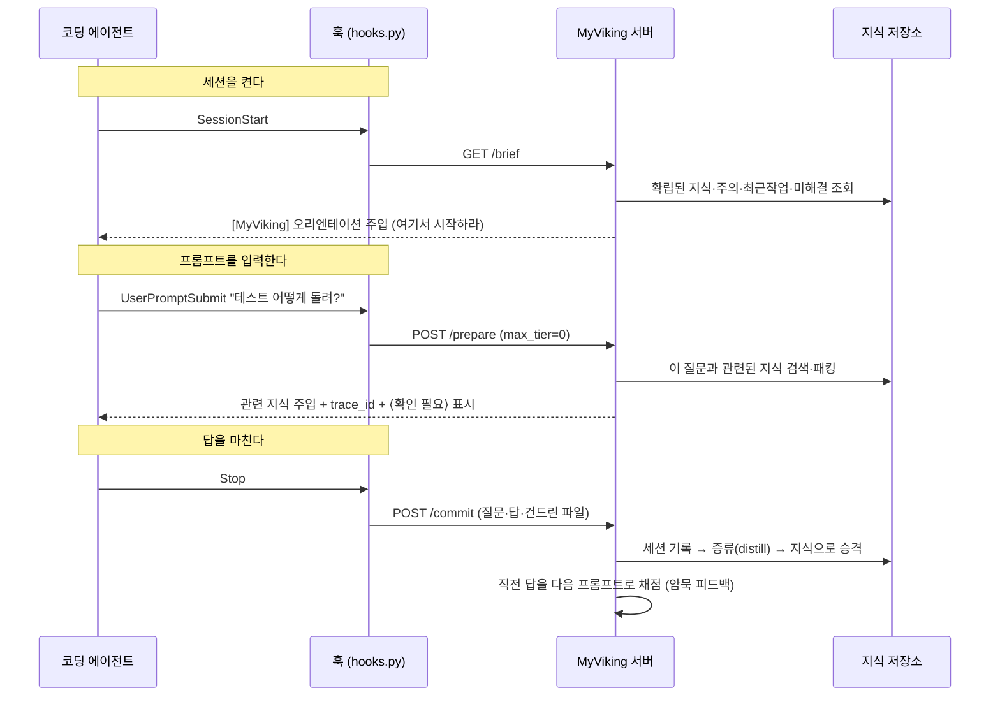
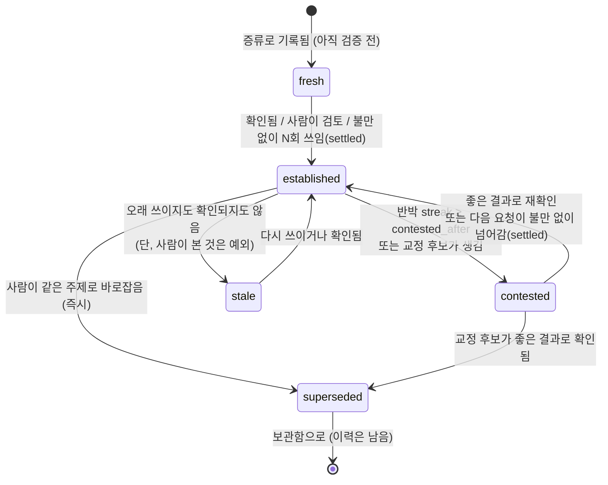

# MyViking 아키텍처

> **한 줄 요약** — 코딩 에이전트에 붙이면, 프로젝트별로 작업이 **자동으로** 쌓이고,
> 다음 세션에 그 지식이 **자동으로** 주입되며, 쓰일수록 **스스로 정답지를 갱신**하는
> 개인용 지식 창고입니다.

이 문서는 지금 코드가 실제로 어떻게 동작하는지를 그림 위주로 설명합니다.
파일 경로는 `src/jarvis/` 기준입니다.

---

## 1. 한눈에 보기

```
        당신의 노트북 / CI / 회사 서버                          당신의 개인 서버 (Docker 한 방)
   ┌───────────────────────────────────┐               ┌──────────────────────────────────────┐
   │  코딩 에이전트 (Claude Code, Cursor,│    HTTPS       │  MyViking 서버                         │
   │   Codex, 셸 전용 에이전트 …)         │──────────────▶│  ┌────────────┐   ┌────────────────┐  │
   │                                    │   Bearer 키    │  │  FastAPI   │──▶│  Jarvis (코어) │  │
   │  ▸ 세션 시작 → 브리핑 주입          │◀──────────────│  │  server.py │   │   service.py   │  │
   │  ▸ 프롬프트  → 관련 지식 주입        │   컨텍스트     │  └────────────┘   └───────┬────────┘  │
   │  ▸ 작업 끝   → 자동 기록·증류        │               │                           │           │
   └───────────────────────────────────┘               │      ┌────────────────────┼────────┐  │
                                                        │      ▼          ▼          ▼        │  │
             연결하는 3가지 방법                         │  markdown     SQLite    임베딩       │  │
        ┌──────────┬──────────┬──────────┐              │  (원본 지식)  (색인)    (검색)       │  │
        │  훅       │  MCP     │  셸 브리지 │             │  JARVIS_HOME 볼륨 하나에 전부        │  │
        │ (무인)    │ (도구)   │ (jv remote)│            └──────────────────────────────────────┘  │
        └──────────┴──────────┴──────────┘                            │
                                                                       ▼
                                                          대시보드 (ui.py) — 사람이 보고 고치는 화면
                                                          Google Drive 백업 (backup.py)
```

**설계의 중심 한 가지**: 지식 캡처가 에이전트의 *자발적 협조*에 기대지 않습니다.
MCP 도구는 에이전트가 "호출하기로 선택"해야 동작하지만, **훅**은 세션·프롬프트·종료마다
무조건 실행됩니다. 그래서 "자동"이 실제로 자동입니다.

---

## 2. 핵심 개념 세 가지

| 개념 | 무엇을 푸나 | 어디서 |
|---|---|---|
| **① 자동 캡처** | 에이전트가 호출을 잊어도 작업이 기록된다 | `hooks.py` |
| **② 티어 컨텍스트 (L0/L1/L2)** | 필요한 만큼만 토큰을 쓴다 (요약→개요→전문) | `tiers.py`, `retrieve.py` |
| **③ 자가 진화 정답지** | 틀린 것으로 드러난 지식은 스스로 물러나고 교정된다 | `learn.py`, `service.py` |

아래에서 하나씩 그림으로 풉니다.

---

## 3. 데이터 모델 — 마크다운이 원본, SQLite는 색인

지식의 **원본은 사람이 읽을 수 있는 마크다운 파일**입니다. SQLite 는 그걸 빠르게
찾기 위한 거울일 뿐이라, 색인이 날아가도 파일에서 다시 만듭니다.

```
jarvis://projects/<프로젝트>/memories/<카테고리>/<제목>      ← 지식 하나의 주소(URI)
                     │           │            │
                     │           │            └─ 파일명이 된다. 누적형 카테고리는 같은 제목 = 한 파일,
                     │           │               사례형(cases)은 같은 제목이면 최신이 남고 옛것은 보관.
                     │           │               사람이 같은 제목으로 다시 쓰면 '대체'(본문·이력까지)
                     │           └─ 프로파일이 정한 스키마 (commands, pitfalls, decisions …)
                     └─ 프로젝트 = 스코프. 프로젝트끼리는 서로의 사실을 섞지 않는다.

jarvis://global/memories/preferences/...                     ← 프로젝트를 넘는 "나"의 선호
```

### 노드 하나는 3층(tier)으로 저장됩니다

```
   ┌─ L0  요약 한 줄 ──────────────┐   검색이 먼저 읽는 층. 싸다. "무엇에 대한 것인가"
   │  "PG 재시도 금지"              │
   ├─ L1  개요 몇 줄 ──────────────┤   후보로 좁혀지면 읽는 층. "왜, 언제"
   │  "결제 승인 실패 시 재시도하면  │
   │   이중 결제. 응답 0000 외 실패" │
   ├─ L2  전문 ────────────────────┤   정말 필요할 때만 펼치는 층. 명령·경로·오류 원문
   │  (근거, 코드, 스택트레이스 …)   │
   └───────────────────────────────┘
```

이 층 구조 덕분에 "관련 있을 법한 것 20개를 L0로 훑고, 진짜 필요한 2개만 L2로
펼치는" 식의 예산 아래 검색이 가능합니다 (`retrieve.py`).

### 디스크 배치

```
$JARVIS_HOME/              (서버 데이터. Docker 는 /data 볼륨, 직접 실행은 기본 ~/.jarvis)
├── projects/
│   └── payments/
│       ├── profile.yaml           프로젝트 스키마(카테고리·경고 카테고리)
│       └── memories/
│           ├── pitfalls/PG-재시도-금지.md
│           └── _archive/…          대체·보관된 지식 (지워지지 않고 남는다)
├── global/                        "나"의 선호 (모든 프로젝트에 함께 주입)
├── index.db                       SQLite 색인 + 트레이스/점수/사용량
└── auth.enabled                   키가 하나라도 생기면 찍히는 마커 (인증 상태)
```

---

## 4. 자동 캡처 루프 — 훅이 하는 일

Claude Code 훅 4개가 세션의 뼈대에 걸려 무조건 실행됩니다. 전부 **fail-open** —
서버가 죽어도 코딩 세션을 막지 않고, 흔적만 남깁니다.



보내기 전에 **비밀값을 지웁니다**(`redact.py`). API 키·토큰·비밀번호 대입문·JWT·개인키
블록·URL 속 자격증명은 `[REDACTED]` 로 바뀌어 서버에 닿습니다. 훅이 없는 MCP·셸 클라이언트를
위해 서버의 `commit()`/`prepare()`/`remember()` 에서도 한 번 더 지웁니다. 한 번 들어간 값은 이후 모든
세션과 스코프 키 보유자에게 다시 주입되기 때문입니다.

핵심은 **에이전트가 "기록해줘"라고 부탁하지 않아도** 캡처된다는 점입니다.
에이전트가 추가로 하는 일은 딱 둘 — 무엇이 *확정*인지 알리는 `jarvis_remember`,
결과가 어땠는지 알리는 `jarvis_score` (이건 사람/에이전트만 판단할 수 있으니까).

훅이 실패하면: 에이전트 머신의 `~/.myviking/hook-state/errors.log` 에 흔적(서버 데이터와는
다른 위치입니다), 서버가 키를 거부하면
세션당 한 번 화면에 알림, `jv agent hooks --check` 로 설치·인증 상태 점검.

---

## 5. 검색·주입 경로 — `prepare()`가 하는 일

```
질문 "결제 재시도 어떻게?"
        │
        ▼
 ┌──────────────────────┐   ① 캐시 확인: 전에 같은 질문에 답했나? (sessions.py)
 │  거친→고운 검색        │       있으면 그 답을 "유효한지만 확인하고 재사용" 하라고 준다
 │  (retrieve.py)        │
 │                       │   ② 디렉터리 우선 검색: 카테고리를 좁히고, L0로 후보를 훑고,
 │  L0 훑기 → 후보 좁힘   │       상위만 L1/L2로 펼친다. 예산(토큰) 안에서.
 │  → 예산 내 패킹        │
 └──────────┬───────────┘   ③ 경고 카테고리(pitfalls 등)는 맨 앞으로 끌어올린다
            │               ③' 초점(focus): 같은 제목은 1건만. 질문과 맞는 근거(벡터·어휘·디렉터리)가
            │                   없는 항목은 저장소 크기와 무관하게 버린다(min_relevance) — 관련 지식이
            │                   없으면 팩이 비고, 에이전트는 MyViking 없을 때와 똑같이 일한다.
            │                   항목 상한(max_items=8)을 넘으면 최고 점수의 45% 미만도 버린다.
            │                   어휘 검색은 한국어 조사·어미를 벗겨 접두 매칭한다("재시도해도" → "재시도하지").
            │                   ⚠ 경고(어휘 일치)와 전역 선호는 언제나 남는다
            │
            ▼
 ┌──────────────────────┐   ④ 신뢰 표시: 확정이 아닌 항목은 trust_notes 로 뽑아
 │  주입 블록 구성        │       "이건 사실로 단정 말고 확인하라"고 붙인다  ← 6장
 │  (service.prepare)    │
 │  + 다른 프로젝트 참고  │   ⑤ "다른 프로젝트에서 이렇게 했다"는 라벨을 붙여 따로 (검증 안 됨 명시)
 └──────────┬───────────┘
            │
            ▼   trace_id 를 함께 실어 보낸다 → 나중에 이 답이 어땠는지 되짚을 앵커
      에이전트 프롬프트에 주입
```

이 과정에서 **아낀 토큰을 추정이 아니라 측정으로 기록**합니다(`budget.py`, 사용량 로그).
"전체를 다 넣었다면 얼마였을지" 대비 "실제로 얼마를 넣었는지"의 차이가 절감량입니다.

---

## 6. 자가 진화 정답지 — 이 프로젝트의 핵심 ⭐

문제의식: 주입된 지식을 에이전트가 **"확인된 사실"로 받으면**, 한때 맞았지만
지금은 틀린 지식이 계속 정답 행세를 합니다. 그래서 지식마다 **신뢰 상태**를 두고,
결과에 따라 그 상태가 **양방향으로** 움직이게 했습니다.

### 신뢰 상태 기계 (`service.trust()`)



| 상태 | 의미 | 주입될 때 |
|---|---|---|
| `established` **확립** | 결과가 뒷받침한 사실 | 표시 없이 "확립된 지식"으로 |
| `fresh` **검증 전** | 증류로 생김, 확인·검토·settled 아직 없음 | ⟨검증 전⟩ |
| `tentative` **미확정** | 신뢰도가 사실 기준선 아래 | ⟨미확정⟩ |
| `stale` **오래됨** | 오래 확인·사용 없음 | ⟨오래됨⟩ |
| `contested` **확인 필요** | 최근 결과가 어긋남, 또는 교정 후보가 있음 → 정답지에서 내려옴 | 주입 안 됨 + trust_notes 경고 |
| `superseded` **대체됨** | 최신 교정본으로 갱신됨 | 주입 안 됨 (보관) |

> **왜 "주입 3회"나 "7일"로는 확립되지 않나** — 주입됐다는 것은 검색에 걸렸다는 뜻일 뿐,
> 맞았다는 증거가 아닙니다. 그래서 fresh 를 벗는 조건은 셋뿐입니다: 좋은 결과로 확인,
> 사람이 대시보드에서 검토, 또는 그 지식이 실린 답 뒤에 사용자가 **불만 없이 다음 일로
> 넘어간 것(settled)** 이 `settled_after`회.

### 두 가지 갱신 경로

**(A) 결과로 물러났다가 다시 올라오기** — 매 프롬프트가 직전 답의 채점입니다.

```
"테스트 돌리는 법" 지식이 주입됨  ──▶  에이전트가 그대로 답함
                                             │
             다음 프롬프트: "여전히 안 되는데?"  ──▶  직전 답을 reworked 로 채점 (암묵 피드백)
                                             │        → 이 지식에 blame 귀속, 신뢰↓, 반박 streak++
                                             │        → 그 질문의 답 캐시도 지움
                                             ▼
                          반박이 contested_after 회 쌓이면  ──▶  상태 = contested
                                             │                    (다음부터 "사실"로 주입 안 됨)
             이 지식이 실린 답 뒤에 사용자가       ──▶  streak=0 (settled)  ──▶  다시 established
             불만 없이 다음 일로 넘어가면              (신뢰는 안 오름 — 불만 없음 ≠ 칭찬)
             좋은 결과로 확인되면                ──▶  streak=0, 확인++, 신뢰↑
```

blame 은 **퍼뜨리지 않고 귀속**합니다. 검색이 12개를 줬어도 나쁜 답을 실제로 이끈
상위 항목에만 책임을 지웁니다(`score()` 의 attributed demotion, `_BLAME_FLOOR`).

무엇이 "불만"인가도 좁게 봅니다. "안 되는데·틀렸·doesn't work"는 주제와 무관하게
직전 답에 대한 판정이지만, "고쳐·수정해"는 **직전 작업을 가리킬 때만**(같은 주제, "그거·이
부분" 같은 지시어, 또는 대상 없이 "고쳐줘") 판정합니다. "README 오타 수정해줘"는 다음
작업이지 판정이 아닙니다. 이 구분이 없을 때 실측에서 사람이 쓴 올바른 지식이 두 프롬프트
만에 정답지에서 내려갔습니다.

**(B) 교정이 오답을 대체하기 — 두 속도** `_reconcile_correction()`

```
   최근(수 시간, 같은 세션) 나쁜 결과로 지목된 지식 = "blamed"     (service._recent_blamed)
                         │
   그 직후 생긴 새 지식이  ─ 같은 카테고리 ─ 주제가 겹치면(≥ correction_similarity)
                         │
        ┌────────────────┴──────────────────┐
        ▼ 사람이 remember 로 바로잡음          ▼ 에이전트의 다음 시도가 증류됨
   즉시 대체 (immediate)                  임시 도전 (pending)
   · 옛것 → _archive/, superseded_by      · 옛것: challenged_by=새것 → contested (라이브 유지)
   · 새것: corrects, 신뢰 ≥ 0.7           · 새것: corrects, 신뢰 그대로(검증 전)
                                                   │
                                  새것이 좋은 결과 ──▶ 그때 대체 완결 (superseded)
                                  옛것이 좋은 결과 ──▶ 도전 철회 (vindicated)
                                  다음 요청이 불만 없이 넘어감 ──▶ 도전 철회 (settled)
```

왜 두 속도인가: 불만 직후 에이전트가 낸 두 번째 답은 **아직 맞는지 모르는 재시도**입니다.
그걸 곧바로 정답으로 승격하면, 오답이 오답을 대체하는 일이 생깁니다. 사람이 손으로
바로잡은 것만 즉시 믿습니다. 에이전트 지시문·훅 주입문도 "틀렸으면 **같은 제목**으로
remember 하면 이전 것을 자동 대체(이력 보관)"라고 안내합니다.

### 근거(evidence) 트레일

모든 결과는 지식의 `extra.evidence` 에 날짜와 함께 남습니다(최근 20건). 대시보드
지식 상세에서 "이 지식이 겪은 결과"로 보이고, `확인 N회` / `반박 N회` 칩으로 요약됩니다.
신뢰 숫자만으로는 "천천히 흘러내린 것"과 "방금 반박당한 것"을 구분할 수 없기 때문입니다.

---

## 7. 연동하는 3가지 방법 — 어떤 에이전트든

```
      기능 많음  ◀───────────────────────────────────────────▶  어디서나 됨
   ┌──────────────────┐   ┌──────────────────┐   ┌──────────────────────┐
   │  훅 (hooks.py)    │   │  MCP (mcp_*.py)  │   │  셸 브리지 (remote.py) │
   │  무인 자동 캡처    │   │  도구 9종         │   │  jv remote brief/ctx/  │
   │  Claude Code      │   │  MCP 지원 에이전트 │   │   remember/commit/score│
   │  세션 뼈대에 삽입  │   │  (Cursor/Codex 등)│   │  MCP·훅 둘 다 없어도   │
   └──────────────────┘   └──────────────────┘   └──────────────────────┘
        가장 자동            도구로 호출            셸만 있으면 (= 모든 에이전트)
```

셋 다 같은 루프(브리핑 → 컨텍스트 → 기록 → 채점)를 돌고, 동사만 다릅니다.
연결 정보·설치 명령·에이전트별 스니펫은 `connect.py` 한 곳에서 나옵니다.

---

## 8. 배포 구조 — `deploy/up.sh` 한 방

```
   bash deploy/up.sh [모드]
        │
        ├─ (기본)        127.0.0.1 만 — 이 머신에서만
        ├─ --public      LAN/VPN — --bind 로 인터페이스 제한 (Tailscale IP 등)
        ├─ --domain X    포트포워딩 + HTTPS (Caddy 자동 인증서, DuckDNS 선택)
        ├─ --tunnel      포트 0개 — Cloudflare Tunnel
        └─ --behind-proxy 기존 nginx/Traefik 뒤 업스트림
```

안전 순서가 코드에 박혀 있습니다: **먼저 루프백으로 띄우고 → 관리자 키를 확보한 뒤
→ 바깥에 노출**합니다. 키가 생기기 전에 외부 바인딩하면 "인증 없이 열린 창"이 생기기
때문입니다. 모드는 `deploy/.env` 에 남아 다음 `git pull && up.sh` 가 같은 모드를 유지합니다.

시나리오별 안내(같은 노트북·집 서버·EC2·팀·Tailscale·Cloudflare·NAS·이사·CI)는
README 의 "어디에 띄우나" 표에 있습니다.

---

## 9. 보안·인증

```
   첫 API 키가 생기는 순간  ──▶  auth.enabled 마커 기록  ──▶  서버 전체가 인증 요구
                                                              (그 전엔 로컬 전용으로 열림)

   키 종류:  관리자 키 = 전부 접근        스코프 키 = 지정한 프로젝트만
                                          (미들웨어 + 라우트별 가드로 실제로 가둠)

   방어선:  · 인증 실패 백오프 (분당 10회 → 429, 실패한 시도에만)
            · MYVIKING_TRUST_PROXY=1 이면 X-Forwarded-For 의 마지막 홉만 신뢰 (IP 사칭 차단)
            · 색인 DB 유실 시 무인증 노출 대신 503 (마커가 있으면 "복원하라")
            · 손상 DB 자동 격리 후 파일에서 재색인
```

키는 SHA-256 해시로만 저장되고(`auth.py`), 발급 시 한 번만 평문으로 보입니다.
캡처된 질문·답 속 자격증명은 저장 전에 마스킹됩니다(`redact.py`, `learn.redact_secrets`).
백업(`backup.py`)은 볼륨을 잃어도 지식이 남도록 Google Drive 로 스냅샷을 회전 업로드합니다.

---

## 10. 모듈 지도

| 계층 | 파일 | 역할 |
|---|---|---|
| **입구** | `hooks.py` | Claude Code 훅 수신 (자동 캡처) — fail-open |
| | `mcp_core.py` / `mcp_server.py` | MCP 도구 표면 (stdio·HTTP 공용) |
| | `remote.py` | 셸 브리지 (`jv remote …`) |
| | `server.py` | HTTP API + 인증 미들웨어 |
| | `cli.py` | `jv` 명령줄 |
| | `ui.py` | 대시보드 (사람이 보고 고치는 화면) |
| **코어** | `service.py` | `Jarvis` — 앱이 필요로 하는 단 하나의 클래스. `trust()`·`prepare()`·`commit()`·`score()` |
| | `learn.py` | 증류·병합·대체(자가학습 루프) |
| | `retrieve.py` | 거친→고운 검색과 예산 기반 패킹 |
| | `sessions.py` | 세션 기록 + 답 캐시 |
| | `prompts.py` | 프로젝트별 프롬프트 라이브러리 |
| | `profiles.py` | 프로젝트별 메모리 스키마 |
| **저장** | `store.py` | 마크다운(원본) + SQLite(색인) 저장소 |
| | `db.py` | SQLite 색인 — 공유 커넥션은 재진입 락으로 직렬화 |
| | `models.py` | URI·티어 노드 데이터 모델 |
| | `tiers.py` / `tokens.py` / `budget.py` | L0/L1/L2 생성 · 토큰 추정 · 절감 계산 |
| | `embed.py` / `llm.py` | 임베딩(오프라인 기본) · LLM(선택) |
| **관측** | `trace.py` | 트레이스·관측·점수 (blame 귀속의 근거) |
| **보호** | `redact.py` | 캡처된 텍스트의 자격증명 마스킹 |
| **운영** | `auth.py` / `backup.py` / `config.py` | 키 · 백업 · 설정과 디스크 배치 |

---

## 11. 데이터가 흐르는 한 바퀴 (전체 요약)

```
   ① 세션 시작    brief()      → 확립된 지식만 "사실"로, 나머지는 표시해서 주입
   ② 프롬프트      prepare()    → 관련 지식 검색·패킹 + trace_id + ⟨확인 필요⟩
   ③ 답변          (에이전트)
   ④ 작업 종료     commit()     → 세션 기록 → distill()로 지식 승격
                                 → _reconcile_correction()로 오답 대체
   ⑤ 다음 프롬프트 _infer_previous_outcome() → 직전 답을 채점 (암묵 피드백)
                                 → score()로 신뢰↑↓ + evidence 기록
   ⑥ 시간이 흐르면 decay·archive → 안 쓰이면 잊히고, 대체된 건 보관됨
        └────────────────────── 다시 ① 로. 매 바퀴 정답지가 조금씩 정확해진다 ──────────────┘
```

**요점**: 여기 쌓인 데이터는 고정된 정답이 아니라 **언제든 바뀔 수 있는 기록**입니다.
결과가 말해주는 대로 지식이 오르내리고, 틀린 것은 교정본에 자리를 내주며, 사람은
대시보드에서 그 과정을 보고 개입할 수 있습니다.
