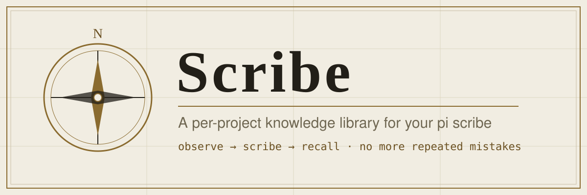

# Scribe (한국어 안내)

**pi 코딩 세션에 서기를 붙여주는 프로젝트 지식 도서관**입니다.
당신은 코딩만 하고, 별도 pi 세션으로 열리는 **서기**가 옆에서 지켜본 뒤
다음에 같은 실수를 하지 않게 필요한 것만 기록해 둡니다.
자세한 영문 문서는 [README.md](README.md) 를 보세요.

## 빠른 시작

```bash
git clone https://github.com/senghan1992/scribe.git
cd scribe
cp .env.example .env
docker compose up -d --build
```

`http://<서버 IP>:8787/` → 가입(첫 가입자 = 관리자) → **새 프로젝트** →
**연결 탭**의 명령 한 줄을 프로젝트 폴더 터미널에 붙여 넣기:

```bash
curl -fsSL http://<서버>:8787/install.sh | bash -s -- --url http://<서버>:8787 --key sc_xxxx --project <slug>
```

## 핵심 원칙

- **폴더별 옵트인 (git 처럼).** 연결 파일이 없는 폴더는 완전히 자유롭게 —
  기록도 주입도 0. 설치했다고 자동으로 붙지 않습니다.
- **작업 세션은 관찰만.** 판단·등재는 서기의 일입니다.
- **서버에 모델 키 불필요.** 서기는 당신의 pi 런타임을 재사용합니다.

## 서기 붙이기

```bash
cd ~/my-project
scribe connect                       # 이 폴더를 도서관에 연결
scribe secretary once                 # 서기 한 번 부르기 (백그라운드)
scribe secretary auto on --every 8    # 관찰 8건마다 서기 자동 호출
scribe secretary auto on --folder --every 5   # 이 폴더만 자동 (폴더별 설정)
scribe secretary status               # 대기 관찰 · 반복 후보 · 마지막 보고
scribe status                          # 이 폴더 상태 한 화면
scribe disconnect                      # 이 폴더 연결 해제 (키는 보관됨)
```

pi 안에서는 `/scribe secretary once`, `/scribe secretary status`,
`/scribe note "기록할 가치 있음"` 으로 같은 일을 합니다.

## 구 이름(myviking)에서 이주

읽기는 구 경로를 먼저 봅니다. `~/.myviking`·연결 파일·`MYVIKING_*`·`jv_`
키가 그대로 동작하고, 새로 쓰는 것만 `~/.scribe`·`SCRIBE_*`로 갑니다.
마무리하려면 `mv ~/.myviking ~/.scribe` 한 번 (자세히는 README.md 이주 섹션).

## 라이선스

MIT — [LICENSE](LICENSE).
