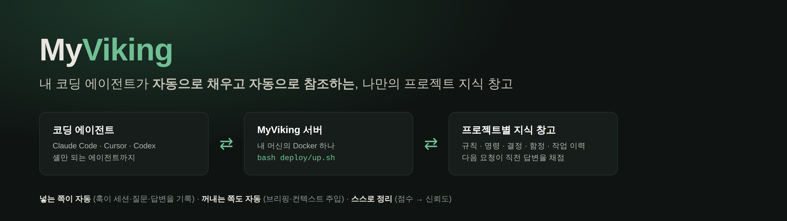
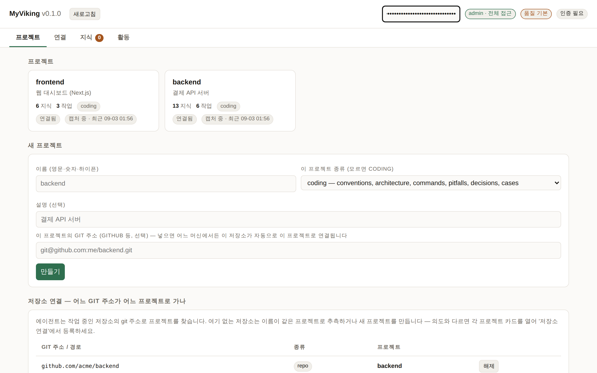
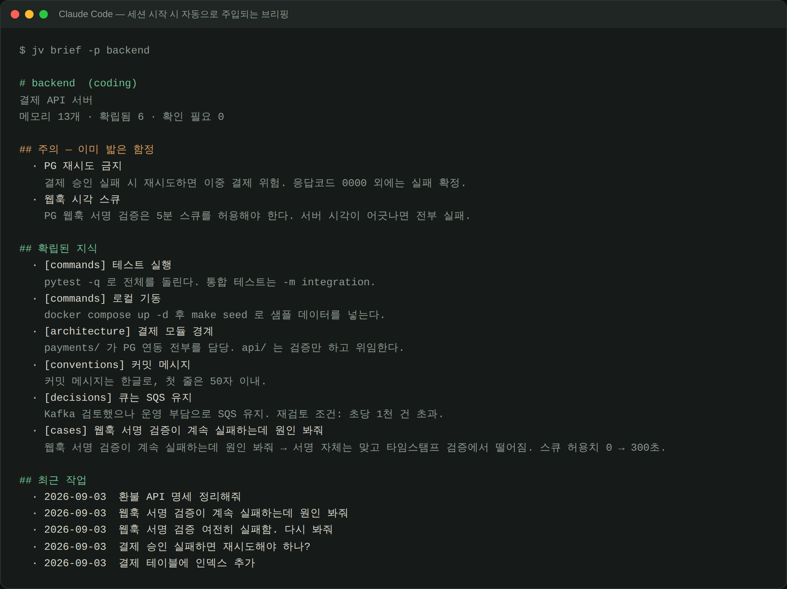
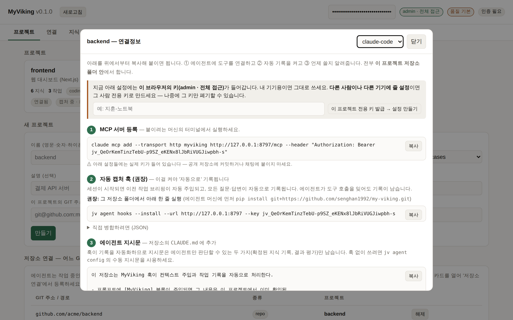
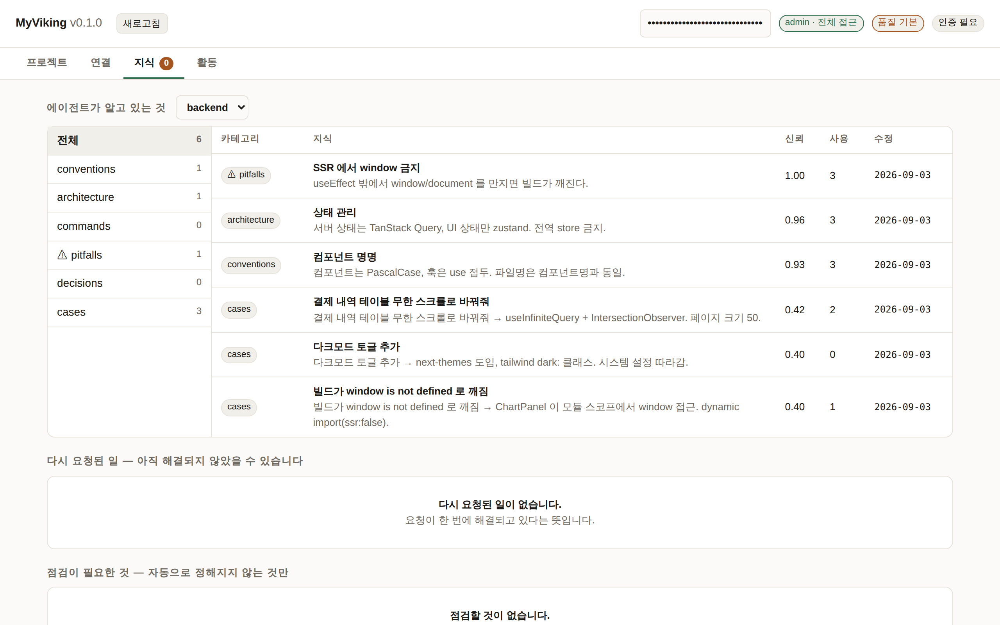
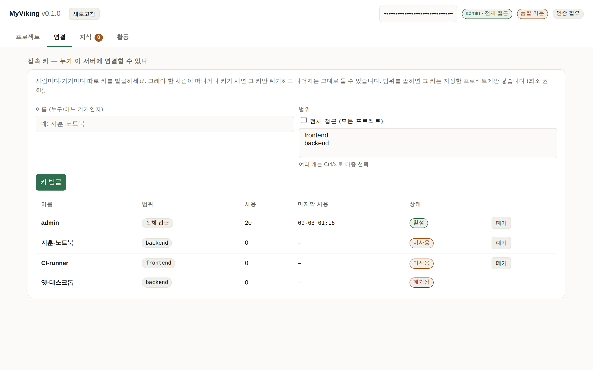
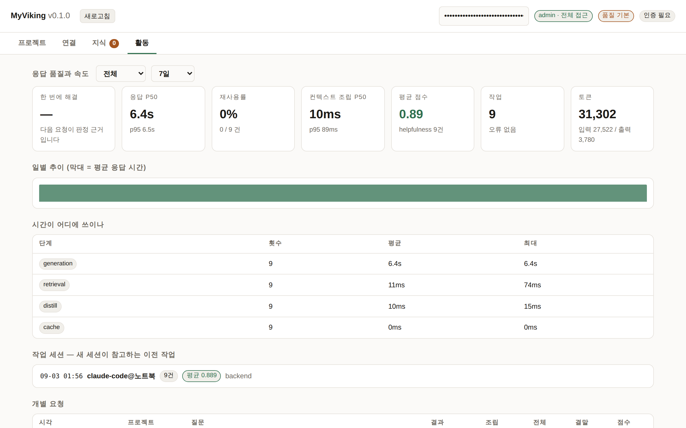

<p align="center">
  
</p>

<p align="center">
  <a href="LICENSE"></a>
  
  
  
  
</p>

<p align="center">
  <b>내 코딩 에이전트가 자동으로 채우고 자동으로 참조하는, 나만의 프로젝트 지식 창고.</b><br>
  Docker 로 서버 하나를 띄우면 어느 머신의 어떤 에이전트든 같은 창고를 씁니다. 데이터는 전부 내 서버에만 남습니다.
</p>

<p align="center">
  <a href="#빠른-시작--명령-세-개">빠른 시작</a> ·
  <a href="#화면-둘러보기">화면 둘러보기</a> ·
  <a href="#docker-로-띄우기-권장">Docker 배포</a> ·
  <a href="#집-서버를-밖으로-여는-체크리스트-포트포워딩">외부 노출</a> ·
  <a href="#에이전트-붙이기--claude-code-는-훅으로-권장">에이전트 붙이기</a> ·
  <a href="#보안">보안</a> ·
  <a href="ARCHITECTURE.md">구조 한눈에</a>
</p>

---

보통의 저장 창고와 세 가지가 다릅니다.

- **넣는 쪽이 자동** — 훅이 세션 시작·질문·답변·변경 파일을 알아서 기록합니다.
  "이거 저장해"라고 말할 필요가 없습니다.
- **꺼내는 쪽도 자동** — 세션이 시작되면 이전 작업 브리핑을, 질문마다 관련 컨텍스트를
  에이전트 프롬프트에 먼저 넣어 줍니다. 저장소를 처음부터 다시 훑지 않습니다.
- **스스로 정리** — 다음 요청이 직전 답변을 채점하고, 그 점수가 쓰인 지식의 신뢰도를
  올리거나 내립니다. 틀린 것은 가라앉고 맞는 것은 앞으로 나옵니다.

목표는 토큰을 줄이는 것이 아니라 **더 빨리 더 나은 답을 얻는 것**입니다. 매번 저장소를
다시 탐색하고, 이미 정한 규칙을 다시 묻고, 지난주에 밟은 함정을 다시 밟는 일을 없애는
쪽입니다. 토큰은 그 결과로 줄어듭니다.

[volcengine/OpenViking](https://github.com/volcengine/OpenViking) 의 세 가지
아이디어에서 출발했습니다: 컨텍스트를 가상 파일시스템으로 다루기(`jarvis://`),
L0/L1/L2 티어 로딩, 세션에서 장기 메모리 증류.

지금 내부가 어떻게 도는지 그림으로 보려면 [ARCHITECTURE.md](ARCHITECTURE.md) 를 보세요 —
자동 캡처 루프, 검색·주입 경로, 정답지가 스스로 갱신되는 신뢰 상태 기계까지.

---

## 빠른 시작 — 명령 세 개

필요한 것은 서버 머신의 **Docker** 하나입니다. 그 외에는 호스트에 아무것도 설치하지
않습니다. 어디에 띄울지(같은 노트북 / 집 서버 / EC2 / NAS / VPN / Cloudflare Tunnel / 기존
프록시 뒤)에 따라 달라지는 부분은 [어디에 띄우나](#어디에-띄우나--시나리오별-가이드) 절에
따로 정리했습니다. 포트포워딩이 부담스러우면 **E(Tailscale)** 나 **F(Cloudflare Tunnel)** 이 더 쉽습니다.

### 1. 서버 띄우기 (서버가 될 머신에서, 한 번)

```bash
git clone https://github.com/senghan1992/my-viking.git && cd my-viking
bash deploy/up.sh                              # 이 머신에서만 쓸 때 (127.0.0.1:8787)
```

밖에서도 붙을 거면 둘 중 하나로 띄우세요. 둘 다 **관리자 API 키를 먼저 발급한 뒤에만**
바깥에 열고, 키를 한 번 출력합니다(다시 볼 수 없으니 저장). 다시 실행해도 키를 새로
만들지 않습니다.

```bash
bash deploy/up.sh --domain viking.duckdns.org  # HTTPS (권장) — Caddy 가 인증서를 자동 발급
bash deploy/up.sh --public                     # 평문 HTTP — 같은 집/사무실 네트워크 안에서만
```

끝나면 **대시보드 주소**와 다음 할 일이 출력됩니다. `--domain` 은 포트포워딩(또는
보안 그룹)과 DNS 가 끝나야 열립니다 — 그 순서는 시나리오 절에 있습니다.

### 2. 대시보드 열어 보기 (브라우저)

주소를 열고 오른쪽 위 칸에 관리자 키를 넣으면 빈 프로젝트 목록이 보입니다. **여기서
프로젝트를 만들 필요는 없습니다** — 3단계에서 저장소의 git 주소로 자동 생성됩니다.
이름을 직접 정하고 싶을 때만 **새 프로젝트**로 만드세요.

<p align="center"></p>

다른 사람·다른 기기가 붙을 거면 **연결** 탭에서 그 사람 이름으로 키를 따로 발급하세요.
관리자 키를 나눠주면 나중에 한 사람만 끊을 수 없습니다.

### 3. 에이전트 머신에서 자동 기록 켜기 (그 저장소 폴더에서, 한 번)

```bash
pipx install git+https://github.com/senghan1992/my-viking.git   # 얇은 CLI 하나. pipx 가 없으면 pip install --user
cd ~/work/my-project
jv agent hooks --install --url https://viking.duckdns.org --key jv_...
```

마지막 줄에 **`✓ 서버 확인: … 키 '이름' (범위)`** 가 나오면 끝입니다. 주소나 키가 틀리면
그 자리에서 `⚠ 서버 확인 실패` 로 멈추니, 몇 주 뒤에 "왜 아무것도 안 쌓였지"가 되지
않습니다. 훅은 `.claude/settings.local.json`(개인 파일, Claude Code 가 기본으로 gitignore)
에 들어가므로 키가 저장소에 커밋되지 않습니다.

이제 그 폴더에서 Claude Code 를 열고 하던 대로 일하면 첫 질문부터 기록이 쌓이고, 다음
세션은 "지난번에 뭘 했는지" 브리핑을 받고 시작합니다. 프로젝트는 git remote 로 서버가
자동으로 만들고 연결합니다. 에이전트가 도구로 지식을 직접 남기게 하려면 MCP 도 한 줄
붙이세요(대시보드 연결정보 ①번, 선택):

```bash
claude mcp add --transport http myviking https://viking.duckdns.org/mcp --header "Authorization: Bearer jv_..."
```

다음 세션의 에이전트가 첫 프롬프트 전에 받는 것입니다. 이미 밟은 함정이 맨 위에 옵니다.

<p align="center"></p>

뭔가 이상하면 언제든:

```bash
jv agent hooks --check --url https://viking.duckdns.org --key jv_...
```

훅 설치 여부 · 서버 연결 · **키가 실제로 받아들여지는지** · 마지막 성공 · 최근 실패를
한 화면에 보여 줍니다. 훅은 실패해도 코딩 세션을 깨지 않지만(fail-open), 키가 거부되면
Claude Code 화면에 한 세션당 한 번 `[MyViking] 서버가 요청을 거부했습니다` 가 뜹니다.
실패 기록은 `~/.myviking/hook-state/errors.log` 에 남습니다.

> Cursor·Codex 등 **훅이 없는 MCP 클라이언트**나 **MCP 자체가 없는 에이전트**는
> 연결정보 드롭다운에서 그 클라이언트를 고르면 됩니다 — 자세한 건
> [에이전트 붙이기](#에이전트-붙이기--claude-code-는-훅으로-권장) 절.

카드를 클릭하면 나오는 연결정보입니다. 복사 버튼 세 번이면 끝납니다.

<p align="center"></p>

### 그다음 (권장 순서)

1. **백업 연결** — 볼륨을 잃어도 지식은 남습니다. 대시보드 첫 화면의 백업 패널,
   또는 [백업 절](#백업--볼륨이-사라져도-살아남는-사본).
2. **품질 올리기** — 기본값은 오프라인 폴백이라 동작은 하지만 **동의어·다른 표현은 못 찾습니다**
   ("릴리스 어떻게?" 로 "배포 명령"을 못 꺼냄). `deploy/.env` 에 두 줄을 넣고 `up.sh` 를 다시
   실행하세요: `ANTHROPIC_API_KEY`(요약·증류) 와 `JARVIS_EMBED_PROVIDER=openai` +
   `OPENAI_API_KEY`(의미 회상; 무료로 하려면 Ollama). `up.sh` 가 끝날 때 지금 어느 수준인지
   알려 줍니다. [LLM·임베딩 붙이기](#llm임베딩-붙이기-선택)
3. **문제가 생기면** — [증상별 대응](#문제가-생기면--증상별-대응) 절.

---

## Docker 로 띄우기 (권장)

`deploy/up.sh` 하나가 빌드 → 루프백 기동 → 헬스체크 → (노출 모드면) 키 확인 → 노출까지
합니다. 다시 실행하면 업데이트이고, 키를 새로 만들지 않습니다.

| 명령 | 바인딩 | 언제 |
|---|---|---|
| `bash deploy/up.sh` | `127.0.0.1:8787` | 서버와 에이전트가 같은 머신 |
| `bash deploy/up.sh --domain <도메인>` | Caddy 443 → 내부 8787 | 포트포워딩·EC2 등 인터넷에 열 때 (HTTPS 자동) |
| `bash deploy/up.sh --tunnel` | 포트 없음, Cloudflare Tunnel | 포트를 못/안 열 때 (HTTPS, 무료) |
| `bash deploy/up.sh --public --bind <VPN IP>` | 그 IP 의 8787 만 | Tailscale·WireGuard 로 붙을 때 |
| `bash deploy/up.sh --behind-proxy` | `127.0.0.1:8787` + XFF 신뢰 | 이미 nginx/Traefik/NPM 이 있을 때 |
| `bash deploy/up.sh --public` | `0.0.0.0:8787` (평문) | 같은 LAN 안에서만 |

`--dry-run` 을 붙이면 docker 없이 무엇을 할지(모드·바인딩·프록시 신뢰·프로필)만 출력합니다.

```
대시보드   http://127.0.0.1:8787/     (또는 https://<도메인>/)
API 문서   .../docs
원격 MCP   .../mcp
```

운영 명령은 `deploy/` 폴더에서:

```bash
cd deploy
docker compose logs -f                      # 로그
docker compose down                         # 중지 (데이터는 볼륨에 남음)
git pull && bash up.sh                      # 업데이트
docker compose exec myviking jv key list    # 터미널에서 키 보기 (대시보드 연결 탭과 같음)
cp .env.example .env                        # LLM 키 등 선택 설정
```

데이터는 `myviking-data` 볼륨에 남으므로 `down`/`up` 은 물론 컨테이너를 지워도
살아있습니다. 볼륨이나 호스트 자체를 잃는 경우는
[백업](#백업--볼륨이-사라져도-살아남는-사본)이 커버합니다.

이미지는 논루트(`viking`, uid 10001)로 돌고, 컴포즈가 루트 파일시스템을 읽기
전용으로 잠그며(`/data` 볼륨과 `/tmp` 만 쓰기 가능), 기본 포트 바인딩은
`127.0.0.1` 입니다. 서버 안에서 6시간마다 증류·감쇠가 돌아가므로 별도 스케줄러가
필요 없습니다(`--maintain-every`, 0 이면 끔).

### Docker 없이

```bash
python3 -m venv .venv && .venv/bin/pip install -e ".[all]"     # (uv 가 있으면: uv venv && uv pip install -e ".[all]")
export PATH="$PWD/.venv/bin:$PATH"
jv key create admin          # 밖에 열 거면 먼저. 데이터는 JARVIS_HOME (기본 ~/.jarvis) 에
jv serve                     # 127.0.0.1:8787. 밖에 열려면 --host 0.0.0.0 + 앞에 Caddy
```

`deploy/` 에 systemd 유닛과 Caddyfile(자동 TLS)도 있습니다. 코어는 PyYAML 하나만
의존하므로 `[server]` extra 없이 설치하면 CLI 만 동작하고 `jv serve` 는 어떤
패키지가 필요한지 알려주며 종료합니다.

### 백업 — 볼륨이 사라져도 살아남는 사본

쌓이는 것은 몇 달치 프로젝트 지식입니다. 볼륨은 `down/up` 에는 살아남지만
볼륨 삭제나 호스트 장애에는 살아남지 못하므로, 서버가 **개인 구글 드라이브로
직접 백업**합니다. 서비스를 띄운 뒤 언제든 연결할 수 있습니다.

1. [Google Cloud 콘솔](https://console.cloud.google.com/apis/credentials)에서
   OAuth 클라이언트를 만듭니다 — 유형은 **"TV 및 제한된 입력 장치"**. Drive API
   를 사용 설정하고 ID·시크릿을 받아둡니다. (개인 계정이면 한 번이면 됩니다.)
2. 대시보드 첫 화면의 **백업** 패널에 넣거나, 터미널에서:

```bash
docker compose exec myviking jv backup connect \
  --client-id 123-abc.apps.googleusercontent.com --client-secret GOCSPX-...
# → 표시된 URL 을 아무 브라우저에서 열고 코드를 입력하면 연결 끝
```

서버에 브라우저가 없어도 되는 기기 코드 방식이고, 발급된 토큰은 `drive.file`
범위라 **이 앱이 만든 폴더 밖은 읽지 못합니다**. 대시보드의 백업 패널은 이
과정을 3단계(클라이언트 만들기 → 서버에 알려주기 → 계정 승인)로 안내합니다.

연결이 끝나면 **어디로 가는지가 화면에 남습니다**: 연결된 계정 이메일, 저장
폴더 이름과 Drive 바로가기 링크. "지금 백업"을 누르면 방금 올라간 파일이
원격 폴더의 실제 목록으로 바로 조회되므로, 백업이 진짜 도착했는지 서버 기록이
아니라 드라이브 쪽을 보고 확인할 수 있습니다. 이후 서버가 주기(기본
12시간)마다 스냅샷을 올리고 보관 개수(기본 14개)를 넘는 것은 지웁니다.
스냅샷은 실행 중에도 안전합니다(SQLite backup API). 그만 쓰려면
`jv backup disconnect` — 토큰만 잊고, 올라간 백업은 남습니다.

```bash
jv backup status          # 대상·주기·마지막 결과
jv backup run             # 지금 즉시 한 번
jv backup list            # 드라이브에 있는 스냅샷
jv backup restore --yes   # 최신 스냅샷으로 복원 (복원 후 컨테이너 재시작)
```

업로드는 수백 MB 스토어도 서버 메모리에 통째로 올리지 않도록 **청크 단위
resumable 업로드**로 나가고, 중간에 끊긴 청크는 그 청크만 다시 보냅니다.

복원은 파괴적이라 되돌릴 장치를 자동으로 답니다: `restore` 는 덮어쓰기 직전의
상태를 `pre-restore/` 에 한 부 남기고, 결과에 그 경로를 알려줍니다. 엉뚱한
스냅샷을 복원했다면 그 파일로 되돌리면 됩니다:

```bash
jv backup restore --file /data/pre-restore/myviking-....tar.gz --yes  # 실행 취소
```

새 머신에서의 재해 복구는 세 줄입니다: `up.sh` 로 띄우고 → `jv backup connect`
로 같은 드라이브에 연결하고 → `jv backup restore --yes`.

> 재해 복구에 필요한 OAuth 클라이언트 ID·시크릿은 서버 볼륨 안(`backup.yaml`,
> 권한 600)에만 있습니다. 볼륨째 잃으면 그 값도 함께 사라지므로, **클라이언트
> ID·시크릿은 서버 밖(비밀번호 관리자 등)에 따로 보관**하세요. 이 두 값만 있으면
> 새 머신에서 같은 드라이브에 다시 연결해 복원할 수 있습니다.

구글 드라이브 대신 마운트한 디렉터리(NAS 등)에 남기려면
`jv backup config --provider local --path /backups` 로 바꾸고 compose 에 그
경로를 볼륨으로 추가하면 됩니다.

## 어디에 띄우나 — 시나리오별 가이드

초보·중급·고수 세 사람이 실제로 수행해 보고 막힌 곳을 고친 뒤 그 순서대로 적었습니다.
공통 원칙은 하나입니다 — **키 먼저, 노출은 나중.** 어느 것을 고를지:

| 상황 | 추천 |
|---|---|
| 혼자, 같은 노트북 | **A** |
| 혼자, 집 서버, 밖에서도 | **E** (Tailscale) — 포트 안 열고 5분 |
| 집 서버를 남(팀원)에게도 열기 | **F** (Cloudflare Tunnel) 또는 **B** (포트포워딩 + HTTPS) |
| EC2 · VPS | **C** |
| 이미 프록시로 여러 서비스 운영 | **G** |
| NAS 에 두기 | **H** |
| 팀 | 위 중 하나 + **D** |

### A. 서버와 에이전트가 같은 노트북

```bash
bash deploy/up.sh
jv agent hooks --install --url http://127.0.0.1:8787     # 키 없음 (루프백은 인증 없이 열림)
```

Docker 없이 더 가볍게 띄우려면 [Docker 없이](#docker-없이). 이 형태에서는 키도 TLS 도
필요 없습니다.

### B. 집 서버 + 공유기 포트포워딩 (회사·카페에서 붙기)

순서가 중요합니다. 인증서는 DNS 와 포워딩이 끝난 **다음에** 발급됩니다.

1. **도메인 하나** — 없으면 [DuckDNS](https://www.duckdns.org) 에서 무료로 만듭니다
   (예: `viking.duckdns.org`). 페이지의 **token** 을 복사해 두세요.
2. **집 IP 가 바뀌어도 따라가게** — `deploy/.env` 에 `DUCKDNS_TOKEN=<토큰>` 한 줄.
   `up.sh --domain` 이 갱신 컨테이너를 함께 띄웁니다. (공유기에 DDNS 메뉴가 있으면
   거기서 해도 됩니다. 둘 다 안 하면 며칠 뒤 IP 가 바뀌는 순간 밖에서 끊깁니다.)
3. **서버의 LAN IP 고정** — 공유기 관리 페이지에서 서버 MAC 에 DHCP 고정(예약). `hostname -I`
   가 그 IP 입니다.
4. **포트포워딩** — 외부 **80, 443** → 서버 LAN IP 의 80, 443. **8787 은 열지 마세요.**
   (ISP 가 80 을 막는 경우도 있습니다 — 443 만 열려도 Caddy 는 TLS-ALPN 으로 발급합니다.)
5. **띄우기**
   ```bash
   bash deploy/up.sh --domain viking.duckdns.org
   ```
   관리자 키가 출력됩니다. 저장하세요.
6. **확인** — 밖에서(휴대폰 LTE 등) `curl -I https://viking.duckdns.org/health` 가 200 이면
   끝. 첫 접속 후 인증서 발급에 수십 초 걸릴 수 있습니다. 안 되면
   `cd deploy && docker compose logs caddy` — DNS 가 아직 이 IP 를 안 가리키거나 80/443 이
   막혀 있으면 여기 이유가 나옵니다.
7. **집 안에서** 도메인으로 접속이 안 되면 공유기가 NAT 루프백(헤어핀)을 지원하지 않는
   것입니다. 집 안에서는 `http://<LAN IP>:8787` 대신 — 그건 로컬에만 바인딩돼 있으니 —
   서버에서 직접, 또는 그냥 밖에서 쓰는 주소를 유지하고 집에서는 LAN 접속을 포기하세요.
   (원한다면 공유기 DNS 에 `viking.duckdns.org → LAN IP` 를 등록하면 해결됩니다.)

이후 에이전트 머신에서는 [빠른 시작 3단계](#3-에이전트-머신에서-자동-기록-켜기-그-저장소-폴더에서-한-번)
그대로, `--url https://viking.duckdns.org --key <그 기기 키>` 입니다.

### C. EC2 · VPS (클라우드)

1. **고정 IP** — EC2 는 Elastic IP 를 붙이세요. 재부팅으로 IP 가 바뀌면 DNS 가 깨집니다.
2. **DNS** — 도메인의 A 레코드 → 그 IP. (DuckDNS 도 됩니다.)
3. **보안 그룹 / 방화벽** — 인바운드 **80, 443** 만. 8787 은 열지 않습니다(컨테이너는
   루프백에만 바인딩됩니다).
4. **띄우기**
   ```bash
   bash deploy/up.sh --domain viking.example.com
   ```
   `--public` 도 되지만 평문이고, 완료 메시지의 주소가 **사설 IP**(172.31.x.x) 로 나옵니다 —
   클라우드에서는 `--public --url http://<퍼블릭 IP>:8787` 처럼 안내에 쓸 주소를 직접
   주거나, 그냥 `--domain` 을 쓰세요.
5. **Docker 없이(systemd)** 가려면 `deploy/myviking.service` 머리말의 순서를 지키세요:
   `JARVIS_HOME=/var/lib/myviking` 을 만들고, **같은 JARVIS_HOME 으로** `jv key create admin`
   을 한 뒤 유닛을 켭니다. 다른 홈에 키를 만들면 서비스는 인증 없이 0.0.0.0 에 열립니다.
   TLS 는 Caddy 를 패키지로 설치해 `deploy/Caddyfile` 을 쓰면 됩니다.

### D. 팀으로 쓸 때 (2~5명)

- **사람·기기마다 키 하나.** 대시보드 **연결** 탭에서 이름 + 범위(그 사람 프로젝트만)로
  발급합니다. 연결정보 다이얼로그의 "이 프로젝트 전용 키 발급"을 누르면 그 사람 키가 들어간
  붙이기 패키지가 바로 만들어집니다. 관리자 키는 나눠주지 마세요.
- **에이전트가 달라도 됩니다.** Claude Code 는 훅(`jv agent hooks --install`), Cursor·Codex 는
  MCP 설정 + 지시문, MCP 가 없는 에이전트는 셸 브리지(`export` 두 줄 + `jv remote …`).
  전부 같은 창고에 기록됩니다.
- **한 사람을 끊을 때는 두 곳.** 서버에서 키 폐기 **그리고** 그 사람 클라이언트의 설정
  제거. 폐기된 키로 계속 두드리는 Cursor 는 그 IP 에 429 백오프를 걸지만, 같은 사무실의
  다른 사람 **유효한** 키는 영향받지 않습니다(차단은 실패한 시도에만 걸립니다).
- **업그레이드 전 백업 한 번**: `docker compose exec myviking jv backup run`. 그다음
  `git pull && bash deploy/up.sh` — 스키마 변경은 기동 시 자동 적용되고 수 초 멈춥니다.
- **감시**는 `/health` 의 `degraded` 필드 하나면 됩니다(백업 실패·유지보수 실패·키 DB 유실·
  색인 손상이면 `true`, 사유는 `problems`). UptimeRobot 같은 데서 그 값을 보세요.

### E. 포트포워딩 없이 집 서버에 붙기 ① — Tailscale / WireGuard (개인용 최선)

공유기를 건드리지 않고, 인터넷에 아무것도 노출하지 않고, 인증서도 필요 없습니다. VPN 이
암호화하므로 평문 HTTP 여도 안전합니다. 혼자 쓰는 집 서버라면 이 방법을 먼저 권합니다.

1. 서버와 노트북(과 휴대폰)에 [Tailscale](https://tailscale.com) 을 설치하고 같은 계정으로 로그인.
2. 서버의 Tailscale IP(`tailscale ip -4`, `100.x.y.z`)에만 열기:
   ```bash
   bash deploy/up.sh --public --bind 100.101.102.103
   ```
   LAN 의 다른 기기에는 보이지 않고, 테일넷 안에서만 `http://100.101.102.103:8787` 입니다.
   MagicDNS 를 켰다면 `http://<서버이름>:8787` 로도 됩니다.
3. 노트북에서 `jv agent hooks --install --url http://100.101.102.103:8787 --key jv_...`.

대시보드의 "평문 HTTP" 경고 배너는 이 경우 무시해도 됩니다 — 터널 안입니다. 회사 네트워크가
VPN 을 막으면 F 로.

### F. 포트포워딩 없이 집 서버에 붙기 ② — Cloudflare Tunnel (남에게도 열 때)

도메인이 Cloudflare 에 있으면(무료 플랜) 포트를 하나도 열지 않고 HTTPS 주소를 얻습니다.
ISP 가 80/443 을 막거나, 공유기 설정을 못 하거나, 팀원에게 URL 만 주고 싶을 때.

1. Cloudflare **Zero Trust → Networks → Tunnels → Create tunnel** (Cloudflared). 토큰을 복사.
2. 같은 화면의 **Public hostname**: `viking.example.com` → Service **HTTP** · `myviking:8787`.
3. `deploy/.env`:
   ```
   CLOUDFLARE_TUNNEL_TOKEN=eyJ...
   CLOUDFLARE_DOMAIN=viking.example.com
   ```
4. `bash deploy/up.sh --tunnel` → 관리자 키 출력. `curl -I https://viking.example.com/health`.
   안 되면 `docker compose logs cloudflared`.

Cloudflare 가 실제 클라이언트 IP 를 `X-Forwarded-For` 로 넘기므로 `up.sh` 가 프록시 신뢰를 켭니다.
원하면 Zero Trust **Access** 정책(이메일 OTP 등)을 앞에 한 겹 더 둘 수 있습니다 — MCP 클라이언트는
헤더 인증만 하므로 그 경우 Service Token 을 함께 쓰세요.

### G. 이미 리버스 프록시가 있을 때 (nginx / Traefik / Nginx Proxy Manager / 기존 Caddy)

다른 서비스와 함께 한 프록시 뒤에 두는 경우입니다. MyViking 은 업스트림으로만 둡니다.

```bash
bash deploy/up.sh --behind-proxy --url https://viking.example.com
```

`127.0.0.1:8787` 에만 열리고 `MYVIKING_TRUST_PROXY=1` 이 켜집니다. 프록시 쪽에서 두 가지만:
`viking.example.com → http://127.0.0.1:8787`, 그리고 **`X-Forwarded-For` 를 클라이언트 IP 로
덮어쓰기**(nginx 는 `proxy_set_header X-Forwarded-For $remote_addr;`. `$proxy_add_x_forwarded_for`
는 덧붙이기라 위조 가능 — 마지막 홉만 믿으므로 그래도 동작은 하지만 덮어쓰는 편이 명확합니다).
Traefik·Caddy·NPM 은 기본이 안전합니다. 프록시가 같은 compose 네트워크에 있으면 `MYVIKING_PORTS`
를 비우고 서비스 이름 `myviking:8787` 로 직접 붙여도 됩니다.

#### G-2. 포트·프록시를 내가 관리할 때 (Portainer · docker compose up -d)

`up.sh` 의 모드/포트 주입 없이, 자기 인프라에서 포트와 TLS 를 직접 관리하고 싶으면
`deploy/stack.yml` 하나로 끝납니다 — Portainer 스택에 붙여넣거나 직접 실행합니다:

```bash
cd my-viking && docker compose build          # 이미지를 한 번만 (Docker Hub 에 없음)
docker compose -f deploy/stack.yml up -d      # 또는 Portainer 에 stack.yml 복붙
```

`stack.yml` 안에서 **`ports:` 줄과 환경변수를 자기 환경에 맞게 바로 고치면 됩니다**
(치환 변수가 없습니다). 예: 모든 인터페이스에 열려면 `"127.0.0.1:8787:8787"` 을
`"8787:8787"` 로. Tailscale/VPN IP 만 열려면 `"100.64.0.5:8787:8787"`. 포트포워딩·
TLS 는 자기 공유기/LB/Portainer 포트 퍼블리싱에서 관리하세요. 컨테이너 안 포트는
항상 8787 입니다.

주의 두 가지는 `stack.yml` 머리말에도 있습니다: ① 외부에 열기 **전에**
`docker compose exec myviking jv key create admin` 으로 키부터 만들 것 (키가 없으면
인증 없이 열린 창), ② 프록시 뒤에 둘 때는 `MYVIKING_TRUST_PROXY=1` (틀린 키 차단이
실제 클라이언트 IP 기준이 됩니다).

### H. NAS (Synology / QNAP / Unraid)

Docker 가 있는 NAS 는 좋은 집 서버입니다. SSH 가 되면 A~F 그대로(`bash deploy/up.sh …`).
GUI(Container Manager 등)만 쓰고 싶으면:

1. 저장소를 NAS 로 복사하고 `deploy/docker-compose.yml` 을 프로젝트로 등록. 환경변수
   `MYVIKING_PORTS` 는 비워 두면 `127.0.0.1:8787:8787`(NAS 안에서만) 입니다.
2. 컨테이너 터미널에서 `jv key create admin` → 키 저장.
3. 그 다음에 `MYVIKING_PORTS` 를 `8787:8787`(LAN) 또는 Tailscale IP 로 바꾸고 재시작.
   외부 노출은 NAS 의 리버스 프록시(Synology "로그인 포털 → 고급 → 리버스 프록시")를 쓰고
   `MYVIKING_TRUST_PROXY=1` 을 환경변수로(G 와 같음).

데이터는 `myviking-data` 볼륨에 있습니다. NAS 스냅샷/Hyper Backup 대상에 Docker 볼륨 경로를
넣어 두면 MyViking 자체 백업과 이중이 됩니다.

### I. Windows · macOS · 라즈베리파이

- **Windows 서버**: Docker Desktop + **WSL2** 터미널에서 `bash deploy/up.sh`. PowerShell/cmd 에서는
  `up.sh` 가 돌지 않습니다(Git Bash 는 됩니다). `hostname -I` 가 없어 `--public` 의 안내 주소가
  `127.0.0.1` 로 나오면 `--url http://<LAN IP>:8787` 로 알려 주세요.
- **Windows 에이전트 머신**: 훅 명령은 `MYVIKING_URL=… jv hook …` 형식(POSIX)입니다. Claude Code
  는 Windows 에서 Git Bash 로 훅을 실행하므로 동작하지만, `jv` 가 그 Bash 의 PATH 에 있어야 합니다
  (`pipx install …` 후 `pipx ensurepath`). `jv agent hooks --check` 로 확인하세요.
- **macOS 서버(Mac mini)**: Docker Desktop 또는 OrbStack. `--public` 은 `ipconfig getifaddr en0` 로
  LAN IP 를 잡습니다. 잠들지 않게 `caffeinate` 또는 에너지 설정.
- **라즈베리파이 / ARM**: 이미지가 `python:3.12-slim` 기반이라 arm64 에서 그대로 빌드됩니다
  (첫 빌드 수 분). `numpy` 도 휠이 있습니다. 32-bit(armv7) 는 권하지 않습니다. SD 카드보다 SSD 에
  Docker 데이터를 두세요 — SQLite 쓰기가 잦습니다.

### J. 서버 이사 (노트북 → 집 서버, 집 → 클라우드)

지식은 볼륨 하나에 있습니다. 옮기는 건 백업 한 번, 복원 한 번입니다.

```bash
# 옛 서버
docker compose exec myviking jv backup config --provider local --path /data/_move
docker compose exec myviking jv backup run                    # /data/_move/myviking-…tar.gz
docker cp $(docker compose ps -q myviking):/data/_move ./move # 꺼내기 (또는 Drive 백업이 있으면 생략)

# 새 서버 — 먼저 띄우고, 멈춘 상태에서 복원
bash deploy/up.sh --domain viking.duckdns.org
docker compose stop myviking
docker compose run --rm -v "$PWD/move:/move" myviking jv backup restore --file /move/myviking-….tar.gz --yes
docker compose start myviking
```

키·별칭·작업 이력·전역 선호까지 함께 옵니다(모두 아카이브 안). 에이전트 머신에서는 훅의
`--url` 만 새 주소로 다시 `--install` 하면 됩니다(키는 그대로 유효). Google Drive 백업을
쓰고 있었다면 새 서버에서 `jv backup connect` 후 `jv backup restore --yes` 로 최신본을 끌어옵니다.

### K. CI 에서 도는 에이전트 (GitHub Actions 등)

봇도 기록을 남기고 브리핑을 받을 수 있습니다. 사람 키와 섞지 마세요.

1. 연결 탭에서 `ci-<저장소>` 이름으로 **그 프로젝트만** 범위의 키 발급 → 저장소 Secret.
2. 워크플로에서:
   ```yaml
   - run: pipx install git+https://github.com/senghan1992/my-viking.git
   - run: jv remote brief          # 최근 작업·주의사항을 로그에
     env: { MYVIKING_URL: https://viking.example.com, MYVIKING_KEY: ${{ secrets.MYVIKING_KEY }} }
   ```
   에이전트 스텝(Claude Code Action 등)에는 셸 브리지 지시문(`jv agent config --client shell`)을
   넣습니다. 훅은 대화형 세션용이라 CI 에서는 `jv remote …` 가 맞습니다.
3. 대시보드 활동 탭에서 `agent` 가 `shell@runner…` 로 구분되고, 키별 사용 횟수는 연결 탭에서 봅니다.
   러너 IP 가 매번 바뀌므로 틀린 키로 반복 실패하면 그 IP 만 잠기고 다른 사람은 영향이 없습니다.

## 문제가 생기면 — 증상별 대응

| 증상 | 원인 | 확인·해결 |
|---|---|---|
| 일했는데 대시보드에 아무것도 안 쌓임 | 훅 미설치 / 주소·키 오류 / 서버 다운 | 그 저장소에서 `jv agent hooks --check --url … --key …`. 네 줄(훅 설치·서버·키·마지막 성공) 중 어디가 빨간지 보면 됩니다 |
| Claude Code 에 `[MyViking] 서버가 요청을 거부했습니다` | 키가 틀림·폐기됨·범위 밖 | 대시보드 연결 탭에서 그 키 상태 확인 → 새 키로 `--install` 다시 |
| `429 인증 실패가 너무 잦습니다` | 같은 IP 에서 틀린 키 10회/분 | 틀린 키를 쓰는 클라이언트를 고치면 약 60초 뒤 풀림. 올바른 키는 그 사이에도 통과합니다 |
| 대시보드가 "API 키가 필요합니다" 만 보임 | 키 미입력 또는 오타 | 오른쪽 위 칸에 관리자 키. 잃었으면 서버에서 `docker compose exec myviking jv key create admin` |
| `https://<도메인>` 이 안 열림 | DNS·포워딩·보안그룹 | `curl -I https://<도메인>/health`, `docker compose logs caddy`. 위 B/C 순서 재확인 |
| 집 안에서만 도메인 접속 불가 | NAT 루프백 미지원 | 공유기 DNS 에 도메인 → LAN IP 등록, 또는 밖에서만 사용 |
| 프롬프트마다 몇 초 멈춤 | 서버에 닿지 못해 훅이 타임아웃 | 직전 실패 뒤엔 1초로 줄여 재시도합니다. `--check` 로 서버 상태 확인 |
| 서버 로그에 `색인 DB 가 손상되어 옆으로 치웠습니다` | index.db 손상 | 메모리는 파일에서 자동 재색인. 키·작업 이력은 `jv backup restore` 로 |
| 모든 요청이 503 "API 키 DB 가 없습니다" | index.db 가 지워짐(인증이 켜져 있던 서버) | 백업 복원, 또는 서버에서 `jv key create admin` 으로 다시 잠금 |
| `pip install` 이 거부됨 (`externally-managed-environment`) | 시스템 파이썬 보호 | `pipx install git+…` 또는 `pip install --user git+…` 후 `~/.local/bin` 을 PATH 에 |
| Tailscale 로 붙는데 대시보드가 "평문 HTTP" 경고 | 설계상 경고 | VPN 안이면 무시. 인터넷에 직접 열려 있는 `--public` 이라면 `--domain`/`--tunnel` 로 |
| Cloudflare Tunnel 이 502 | Public hostname 서비스 주소 오류 | Cloudflare 대시보드에서 `HTTP · myviking:8787` 인지(`localhost` 아님) 확인, `docker compose logs cloudflared` |
| 프록시 뒤에서 한 사람이 틀리면 전원 429 | 프록시가 XFF 를 안 넘겨 전부 한 IP | `--behind-proxy` 로 다시 띄우고(TRUST_PROXY=1) 프록시가 `X-Forwarded-For` 를 넘기는지 확인 |
| Windows 에서 훅이 안 돌아감 | Git Bash PATH 에 `jv` 없음 | `pipx ensurepath` 후 터미널 재시작, `jv agent hooks --check` |

## 에이전트 붙이기 — 클라이언트별

어떤 에이전트든 붙습니다. 훅이 있으면 훅으로(가장 자동), MCP 만 있으면 MCP 로, 둘 다 없으면 셸로.

### 저장소를 프로젝트에 연결

보통은 훅이 git remote 로 자동 연결하므로 이 단계가 필요 없습니다. 이름을
직접 정하거나 remote 가 없는 저장소를 묶고 싶을 때만 씁니다.

```bash
# 에이전트를 돌리는 머신(≠ 서버)에서 — 서버에 별칭을 심습니다:
cd ~/work/backend
jv remote link backend       # git remote·경로를 서버의 'backend' 에 묶습니다

# 서버 자신에서 직접 할 때만 로컬 명령:
#   jv link -p backend -t coding
```

> ⚠ `jv link` 는 **로컬** 저장소에만 씁니다 — 원격 서버를 쓰는데 다른 머신에서
> `jv link` 를 실행하면 서버엔 아무것도 안 남아 조용히 무의미합니다. 그 경우엔
> 반드시 `jv remote link` 를 쓰세요.

이제 어느 머신에서든 그 remote 를 가진 체크아웃은 같은 프로젝트로 해석됩니다.
`git@github.com:me/backend.git` 과 `https://github.com/me/backend` 는 같은 것으로
취급합니다.

### 에이전트 붙이기 — Claude Code 는 훅으로 (권장)

MCP 도구는 에이전트가 *호출을 선택해야* 동작합니다. 지시문을 잊거나 건너뛰면
아무것도 기록되지 않습니다. Claude Code 에는 그 선택을 없애는 길이 있습니다:

```bash
jv key create laptop         # 외부에 열 거라면 먼저 키를 발급하세요
claude mcp add --transport http myviking https://viking.example.com/mcp
cd ~/work/backend
jv agent hooks --install --url https://viking.example.com --key jv_...
```

`--install` 이 저장소의 `.claude/settings.local.json`(개인 파일 — 키가 커밋되지 않음, 권한 0600) 에 훅 네 개를 병합하고, 끝에 서버와 키를 실제로 확인합니다.
프로젝트는 git remote 로 정해집니다. remote 가 없는 git 저장소는 폴더 이름을 쓰고, git 저장소가
아닌 폴더(`/tmp`, 홈 등)에서는 프로젝트를 만들지 않고 화면에 한 번 알린 뒤 기록하지 않습니다 —
그런 폴더를 굳이 기록하려면 `--project <이름>` 으로 이름을 박아 두세요.
그 뒤로는 에이전트의 협조 없이도 루프 전체가 돌아갑니다:

| 훅 | 하는 일 |
|---|---|
| **SessionStart** | 체크아웃의 git remote 로 프로젝트를 해석하고, 최근 작업·새로 정해진 것·주의·미해결을 대화에 자동 주입 — 새 세션이 곧바로 이전 맥락에서 시작합니다 |
| **UserPromptSubmit** | 모든 프롬프트를 트레이스로 기록하고(암묵 피드백도 여기서 돌아갑니다), 예산 안의 L0 컨텍스트를 주입합니다 |
| **Stop** | 대화록에서 방금 끝난 질문·답변을 추출해 자동 commit — Langfuse 처럼, 매 턴이 데이터베이스에 남습니다 |
| **SessionEnd** | 세션 상태 정리 |

훅은 전부 fail-open 입니다: 서버가 죽어 있어도 코딩 세션은 깨지지 않고,
그 턴의 기록만 빠집니다. 조용한 실패가 최악이므로, 실패는 흔적을 남기고
점검 명령으로 확인할 수 있습니다 — 서버 연결, 마지막 성공 시각, 최근 실패:

```bash
jv agent hooks --check --url https://viking.example.com --key jv_...
# 서버가 닿지 않으면 종료 코드 1 로 알려줍니다 (기록이 새고 있다는 신호)
```

에이전트 지시문은 두 가지로 줄어듭니다 — 훅이 판단할 수 없는 것들입니다:

```markdown
이 저장소는 MyViking 훅이 컨텍스트 주입과 작업 기록을 자동으로 처리한다.
- 주입된 [MyViking] 블록은 이미 확인된 사실이다. 다시 조사하지 않는다.
- 작업 중 새로 확정된 규칙·명령·함정은 jarvis_remember 로 남긴다.
- 사용자가 만족/불만을 표현하면 jarvis_score 로 보고한다 (trace_id 는 블록에 있다).
```

### 훅이 없는 클라이언트 (cursor / codex / 그 외 MCP)

```bash
jv agent config --client cursor --url https://viking.example.com --key jv_...
```

출력된 MCP 설정과 **수동 지시문**을 그대로 붙이면 됩니다. 이 경우 도구만
연결하고 언제 쓸지 알려주지 않으면 에이전트는 대개 쓰지 않으므로, 지시문이
절반입니다. 수동 지시문은 jarvis_context(시작) → jarvis_remember(작업 중) →
jarvis_commit(끝) → jarvis_score(평가) 의 전체 루프를 에이전트에게 맡깁니다.

### MCP 조차 없는 에이전트 — 셸 브리지

코딩 에이전트는 종류가 많고, 전부가 MCP 를 지원하지는 않습니다. 하지만 셸
명령은 **모든** 에이전트가 실행할 수 있으므로, 같은 루프가 명령으로도
열려 있습니다:

```bash
# 에이전트 머신에 코어만 (의존성 PyYAML 하나):
pip install git+https://github.com/senghan1992/my-viking.git
export MYVIKING_URL=https://viking.example.com
export MYVIKING_KEY=jv_...

jv remote brief                  # 세션 시작: 최근 작업·주의·미해결
jv remote link 내프로젝트         # 이 체크아웃을 서버의 프로젝트에 연결 (선택)
jv remote ctx "결제 실패 처리?"    # 작업 전: 축적된 컨텍스트 + trace_id
jv remote remember pitfalls "PG 재시도 금지" "재시도하면 이중 결제"
jv remote commit "질문" "답변 요약" --trace tr_...
jv remote score tr_... 1.0
```

프로젝트는 cwd 의 git remote 로 자동 해석되므로 `-p` 없이도 됩니다.
에이전트 지시문은 `jv agent config --client shell` 이 출력해 주며(대시보드
연결정보의 드롭다운에도 있습니다), 그 에이전트의 지시문 파일에 붙이면
끝입니다. 출력은 에이전트가 읽는 것을 전제로 설계되어 있습니다 — 컨텍스트
다음 줄에 "끝나면 이 명령을 실행하라"가 붙어 나옵니다.

## 실제로 무엇이 일어나나

노트북의 Claude Code 가 프로젝트 이름도 모른 채 git remote 만으로 붙습니다.

```json
→ jarvis_context {"repo": "https://github.com/me/backend",
                  "question": "결제 승인 실패하면 재시도해야 하나?"}

← {"project": "backend", "trace_id": "tr_493f17…", "reused": false,
   "context_ms": 67,
   "items": [{"tier":"L0","tokens":31,"uri":"…/memories/pitfalls/pg-재시도-금지"},
             {"tier":"L1","tokens":35,"uri":"…/memories/commands/테스트-실행"}],
   "note": "위 컨텍스트는 이 프로젝트에 대해 이미 확인된 내용입니다. 다시 조사하지
            말고 여기서 시작하세요."}
```

작업이 끝나면 결과와 평가를 돌려줍니다.

```json
→ jarvis_commit {"trace_id": "tr_493f17…", "answer": "재시도하지 않습니다…",
                 "latency_ms": 2400}
→ jarvis_score  {"trace_id": "tr_493f17…", "value": 1.0, "comment": "정확"}
← {"memories_adjusted": ["…/pitfalls/pg-재시도-금지", "…/commands/테스트-실행"]}
```

데스크톱의 Cursor 가 같은 질문을 하면 재사용됩니다.

```json
→ jarvis_context {"repo": "git@github.com:me/backend.git", "question": "…"}
← {"reused": true, "similarity": 1.0, "context_ms": 0,
   "answer": "재시도하지 않습니다. 응답 코드가 0000 이 아니면 실패로 확정합니다."}
```

## 사람이 하는 일은 두 번뿐

MyViking 은 사람이 들어가서 작업하는 서비스가 아닙니다. 코딩 에이전트를 위한
인프라이고, 사람의 몫은 **프로젝트를 만들고 연결정보를 가져가는 것**까지입니다.

### 처음 한 번

대시보드(`http://localhost:8787/`)를 열면 첫 화면이 프로젝트 목록입니다.

1. **새 프로젝트** — 이름, 프로젝트 종류(모르면 coding), git 주소(선택)를 넣고 만들기.
2. 카드를 클릭하면 **연결정보**가 나옵니다. 블록을 위에서부터 복사하면 끝입니다.
   - `claude mcp add --transport http myviking https://…/mcp` — 도구 연결
   - **자동 캡처 훅** (claude-code) — 그 저장소에서 `jv agent hooks --install …`
     한 줄(복사 버튼). 이게 기록을 에이전트의 선의에서 떼어내는 블록입니다.
     JSON 을 직접 병합하는 길은 접혀 있습니다.
   - 에이전트 지시문 — 저장소의 `CLAUDE.md` 에 붙여넣기

클라이언트는 드롭다운에서 고릅니다 (claude-code / cursor / codex / 그 외 MCP / shell).
API 키를 켜 두었다면 오른쪽 위 입력란의 키가 설정에 자동으로 포함됩니다 — 단,
그건 **내 브라우저의 키**입니다. 다른 사람·다른 기기에 줄 설정이면 다이얼로그 안의
"이 프로젝트 전용 키 발급"으로 그 사람 키를 심으세요(나중에 그 키만 폐기 가능).
프로젝트 탭 아래 **저장소 연결** 표에서 어느 git 주소가 어느 프로젝트로 가는지
한눈에 보고 해제할 수 있습니다.

훅이 없는 클라이언트에서는 **지시문 블록을 빼면 아무 일도 일어나지 않습니다.**
도구는 연결되지만 에이전트가 호출할 이유를 모르고, 지식은 계속 비어 있습니다.

### 그다음부터

없습니다. 그 저장소에서 평소처럼 작업하면 됩니다.

```
당신: "결제 승인 실패 처리 좀 봐줘"
  → [훅] 세션 첫 프롬프트면 이전 작업 브리핑 자동 주입
  → [훅] 관련 규칙·함정 컨텍스트 주입 + 트레이스 기록
  → 에이전트가 작업, 확정된 것은 jarvis_remember
  → [훅] 턴이 끝나면 질문·답변 자동 commit → 증류
  → 다음 프롬프트가 직전 답을 암묵적으로 채점
```

## 저장소가 스스로 정리되는 규칙

사람이 검토하지 않아도 품질이 유지되도록, 네 가지가 자동으로 돕니다.

| 규칙 | 동작 |
|---|---|
| **쓰이면 강화** | 검색에 포함될 때마다 신뢰도가 오르고, 다음에 더 먼저 선택됩니다 |
| **결과로 조정** | `jarvis_score` 가 그 작업에 쓰인 지식의 신뢰도를 올리거나 내립니다 |
| **안 쓰이면 잊힘** | 오래 쓰이지 않으면 신뢰도가 감쇠하고, 바닥을 치면 `_archive/` 로 |
| **나중 것이 대체** | 모순된 지시가 오면 나중 것이 이깁니다. 이전 것은 보관되고 검색에서 빠집니다 |

마지막 규칙이 핵심입니다. "앞으로 커밋은 항상 한글로" 다음에 "앞으로 커밋은 항상 영어로"가
오면, 나중 지시가 현재 규칙이 되고 이전 것은 보관함으로 갑니다 — 에이전트가 서로 반대되는
두 규칙을 동시에 보는 일이 없습니다. 파일명도 내용에 맞게 따라갑니다.

정직하게 적어 두면, 이 대체는 **규칙으로 인식된 것**끼리만 일어납니다. LLM 없이 규칙 기반
증류만 쓸 때 "규칙"으로 인식되는 문장은 "앞으로·항상·반드시·절대" 같은 표지가 있는
사용자 지시문이고, 그 외의 대화는 질문→답 사례(`cases`)로만 남아 서로를 대체하지 않습니다.
확실하게 바로잡으려면 같은 제목으로 `jarvis_remember`(또는 `jv remote remember`) 를
쓰세요 — 이건 표지 없이도 즉시 대체합니다.

되돌릴 수 있습니다. 보관된 파일에 무엇으로 대체됐는지 기록되고, 카테고리
디렉터리에 그대로 남아 있습니다. 사람이 판단하고 싶다면
`jv config --set learn.conflict_policy=flag` 로 양쪽을 남기고 표시만 하게
바꿀 수 있습니다.

세션 기록은 컨텍스트에 싣지 않습니다. 세션에서 가치 있는 것은 이미 메모리로
증류되었으므로, 원문까지 넣으면 같은 내용을 두 번 싣고 폐기된 지시가 대화록에
인용된 채 읽힙니다. 반복 질문은 답변 캐시가 따로 처리합니다.

지식 계층과 별개로, **기록 계층**(트레이스·토큰 사용량·답변 캐시)도 무한히
쌓이지 않습니다. 주기 유지보수가 오래된 것을 정리합니다 — 트레이스 180일,
사용량 90일, 캐시는 프로젝트당 500개까지(가장 최근 쓰인 것 우선). `0` 으로
두면 영구 보관합니다.

```bash
jv config --set retention.traces_days=365   # 예: 트레이스 1년 보관
jv config --set retention.cache_per_project=0  # 캐시는 정리하지 않음
```

## 화면 둘러보기

사람이 대시보드에서 하는 일은 **프로젝트 만들기와 연결정보 가져가기** 두 가지입니다.
나머지 탭은 에이전트가 쌓은 것을 들여다보는 창입니다.

| 탭 | 무엇을 하나 |
|---|---|
| **프로젝트** | 프로젝트 생성, 연결정보 복사, 저장소(git 주소) 연결 표, 백업 |
| **연결** | 사람·기기별 접속 키 발급 · 범위 · 사용 이력 · 폐기 |
| **지식** | 에이전트가 쌓은 것 확인. 원하면 고칠 수 있지만 필수는 아닙니다 |
| **활동** | 답이 이상하거나 느렸을 때. 단계별 지연과 그 답에 쓰인 지식 |

**지식** — 카테고리별로 무엇이 확립됐고(신뢰), 얼마나 쓰였는지(사용). ⚠ pitfalls 는 브리핑 맨 위로 올라갑니다.

<p align="center"></p>

**연결** — 누가 이 서버에 붙을 수 있나. 한 사람이 떠나면 그 키만 폐기합니다.

<p align="center"></p>

**활동** — 한 번에 해결된 비율, 응답 시간, 단계별 지연, 작업 세션, 개별 요청.

<p align="center"></p>

**지식** 탭 아래의 "점검이 필요한 것"에는 **자동 규칙이 정할 수 없는 것만**
올라옵니다 — 미해소 상충, 나쁜 평가를 받은 지식, 여러 번 쓰였지만 평가가 없는
지식. "에이전트가 기록했고 사람이 보지 않았다"는 것은 정상 상태이므로 세지
않습니다. 보통은 0건입니다.

```bash
jv review              # 0건이 기본입니다
jv review --all        # 감사하고 싶을 때: 사람이 보지 않은 것까지 전부
```

## 다음 프롬프트가 진짜 채점표입니다

명시적 평가는 거의 남지 않습니다. 하지만 **같은 일을 다시 시키는 행동은 거짓말을
하지 않습니다.** "A기능이 구현이 안되었는데 제대로 동작하도록 해줘" 는 직전 작업이
실패했다는 진술이고, 다른 주제로 넘어간 것은 그럭저럭 됐다는 뜻입니다.

그래서 한 자리 안에서 다음 요청이 들어오면 **직전 답변을 자동으로 채점합니다.**
아무도 아무것도 누르지 않아도 됩니다.

| 다음 요청 | 판정 | 값 | 근거 |
|---|---|---|---|
| 교정 요청 ("안 되는데 고쳐줘", "여전히", "still doesn't work") | **다시 요청됨** | 0.1 | 문구 |
| 같은 요청이 곧 다시 (주제 일치) | **같은 요청 반복** | 0.35 | 주제 일치 |
| 다른 주제로 넘어감 | **넘어감** | 0.62 | 주제 불일치 |
| "그럼 …", "추가로 …" | 판정 없음 | — | 이어지는 질문 |

`jv metrics` 의 **한 번에 해결** 이 그 결과입니다.

```
한 번에 해결 83%  (다시 요청 1 / 판정 6건)
  판정 근거: 넘어감 5, 다시 요청됨 1
```

세 가지를 신중하게 다뤘습니다.

**넘어간 것은 약한 신호입니다.** 잘 됐어서 넘어간 것과 포기하고 직접 한 것이
여기서는 똑같이 보입니다. 그래서 긍정(0.62)은 부정(0.1)보다 중심에서 훨씬 가깝고,
암묵적 신호 전체가 명시적 평가보다 절반 세기로만 반영됩니다
(`learn.implicit_strength`). 사람이 직접 준 점수는 절대 덮어쓰지 않습니다.

**"실패"는 불만이 아닐 수 있습니다.** 결제 프로젝트에서 "결제 승인 실패하면
재시도해야 하나?" 는 주제어를 쓴 질문입니다. 그래서 교정 표현(주제와 무관하게
직전 작업을 가리킴)과 장애 어휘(주제가 같을 때만 불만)를 분리했습니다 — 이걸
합쳐 뒀을 때 정상적인 답변이 실패로 기록되는 것을 실제로 확인했습니다.

**다시 요청된 일은 다음 세션이 먼저 압니다.** `catch_up.open_threads` 와
`jv brief` 에 올라오고, 대시보드 지식 탭에도 패널이 있습니다. 새 세션에 넘길
가장 유용한 정보는 "전부 이렇습니다" 가 아니라 **"지난번에 두 번 물었고 아직
안 끝났을 수 있습니다"** 입니다.

```bash
jv metrics -p backend        # 한 번에 해결 / 다시 요청
jv history -p backend        # 세션별로 각 요청의 결말까지
jv config --set learn.implicit_feedback=false   # 끄기
```

## 점수는 지표로 끝나지 않습니다

에이전트가 `jarvis_score` 를 호출하면 **그 작업에 어떤 지식이 들어가 있었는지
기록되어 있으므로**, 같은 신호가 신뢰도를 움직입니다. 이게 모니터링과 학습을
가르는 지점이고, 사람 없이 품질이 오르는 이유입니다.

- 좋은 결과에 함께 있던 지식 → 검색 기여도에 비례해 상승
- 나쁜 결과를 **실제로 주도한** 지식 → 하락 → 임계 아래면 `_archive/` 로

책임은 배분하지 않고 **귀속**합니다. 검색은 관련도 순으로 10여 개를 넘기는데,
오답은 거의 항상 상위 항목이 원인입니다. 전부 똑같이 깎으면 옆에 있었을 뿐인
지식이 자기와 무관한 실패의 손해를 누적합니다. 그래서 조정폭을 기여도로 가중하고,
**부정 평가는 상위 기여자에게만** 닿습니다. 무엇이 틀렸는지 알면 `uris` 로
지목하면 그것만 움직입니다. 전역 선호는 당신의 지시이므로 점수로 깎이지 않습니다.

하락 가중치를 상승보다 크게 두었습니다(-0.44 vs +0.24). 확신을 갖고 틀린 지식이
없는 지식보다 더 해롭기 때문입니다.

`jv impact -p backend` 는 어떤 지식이 좋은 결과에 기여했는지 보여줍니다. 자주
쓰이지만 점수가 없는 지식은 *유용한 것이 아니라 검증되지 않은 것*입니다.

## 정말 "나만의" Jarvis로 만드는 세 가지

컨텍스트 DB 는 물어봐야 답합니다. 어시스턴트는 그 이상을 합니다.

### 1. 전역 선호 — 매 프로젝트에서 다시 말하지 않기

프로젝트가 아니라 *당신*에 관한 것은 `jarvis://global` 에 두고, 모든 프로젝트의
컨텍스트에 함께 실립니다.

```bash
jv me add "답변과 주석은 항상 한글로 작성한다"
jv me add "설명은 짧게, 근거를 먼저 말한다"
jv me add "추측한 명령을 알려주지 말고 확인된 것만 말한다"
jv me list
```

에이전트도 직접 넣을 수 있습니다: `jarvis_remember` 에 `project="global"`.
당신이 직접 쓴 것이므로 검토 대기에 오르지 않고 처음부터 높은 신뢰도를 갖습니다.

### 2. 선제적 경고 — 이미 밟은 함정을 앞에 세우기

프로파일이 **경고 카테고리**를 정합니다(`coding` 은 `pitfalls`, `ops` 는
`incidents`, `research` 는 `contradictions`). 여기 걸리는 메모리는 일반 컨텍스트에
섞이지 않고 프롬프트 맨 앞의 `⚠ 주의` 블록으로 올라가고, 시스템 프롬프트가
"이것을 거스르는 제안은 하지 마세요" 로 지시합니다.

```
# 아래 '주의' 항목을 먼저 읽고, 거스르는 제안은 하지 마세요: PG 재시도 금지

# 컨텍스트
## ⚠ 주의 — 이 프로젝트에서 이미 밟은 함정
### PG 재시도 금지
승인 응답이 0000 이 아니면 재시도하지 않는다
...
```

텍스트를 두 번 싣지 않습니다 — 강조는 위치와 제목으로 하고, 본문은 한 곳에만
둡니다. 어떤 카테고리를 경고로 볼지는 `profile.yaml` 의 `warn: true` 로 바꿉니다.

### 3. 프로젝트 간 회상 — "저번에 어떻게 했었지"

프로젝트는 서로 격리됩니다. 한 프로젝트의 사실이 다른 프로젝트의 사실로 오해되면
안 되기 때문입니다. 하지만 개인 어시스턴트가 답할 수 있는 가장 유용한 질문이
"이거 저번에 어떻게 풀었지"이고, 그 답은 보통 다른 저장소에 있습니다.

그래서 찾아보되 **크게 라벨을 붙입니다**: 요약만, 최대 3건, 그리고

```
# 다른 프로젝트에서 온 참고 — 이 프로젝트에서 검증된 것이 아닙니다
- [infra] 중복 승인 대응: 중복 승인이 발생하면 정산 배치를 멈추고 수동 취소한다
```

이 프로젝트의 컨텍스트 블록에는 들어가지 않습니다. 끄려면 `cross_project=false`.

### 리듬

```bash
jv brief -p backend     # 오랜만에 돌아왔을 때: 확립된 지식·주의사항·미해결
jv digest               # 주기적으로: 전체 프로젝트 한 화면
jv review               # 확인이 필요한 것 (위 두 개가 여기로 안내합니다)
```

`jv brief` 는 한 달 만에 프로젝트로 돌아왔을 때 읽는 것입니다. 전부 쏟아내지 않고
신뢰도 높은 지식, 서 있는 경고, 미해결 결정, 최근 작업으로 나눠 보여줍니다.
에이전트도 `jarvis_profile` 의 `op="brief"` 로 같은 것을 받습니다.

## 프로젝트마다 다른 기억

코드 프로젝트와 리서치 프로젝트는 *다른 종류의* 기억이 필요합니다. 프로젝트마다
`profile.yaml` 로 카테고리·추출 기준·보관 정책·토큰 예산을 따로 정의합니다.

| 템플릿 | 카테고리 |
|---|---|
| `coding` | conventions, architecture, commands, pitfalls, decisions, cases |
| `research` | questions, findings, sources, contradictions |
| `writing` | voice, audience, outline, phrasing |
| `ops` | topology, runbooks, incidents, thresholds |
| `default` | preferences, facts, patterns, cases |

```yaml
- name: commands
  description: 빌드·테스트·배포 명령
  extract: 실제로 동작이 확인된 명령과 전제 조건. 추측한 명령은 저장 금지.
  priority: 9          # 검색 예산 경쟁에서의 우선순위
  keep: 20             # 이 수를 넘으면 약한 것부터 보관함으로
  cumulative: true     # true = 같은 주제는 한 파일에 누적
```

`extract` 는 증류기에게 그대로 전달되는 지시문입니다. 같은 세션이라도 프로파일이
다르면 다른 카테고리에 다른 형태로 저장됩니다. `fallback` 은 어떤 규칙에도 걸리지
않은 관찰이 갈 곳입니다 — 이게 없으면 학습 루프가 도는 것처럼 보이면서 아무것도
쌓이지 않습니다.

`jarvis://global` 은 모든 프로젝트에 적용되는 선호를 담습니다. 프로젝트 메모리는
서로 섞이지 않습니다.

## 왜 빨라지나

세 가지가 각각 다른 이유로 기여합니다.

**1. 탐색을 건너뜁니다.** 규칙·명령·구조를 이미 알고 시작하므로 에이전트가 파일을
훑는 왕복이 사라집니다. 이게 가장 큰 체감 차이이고, 토큰 절감은 그 부산물입니다.

**2. 반복 질문은 재사용합니다.** 정확 일치는 정규화된 해시로, 표현만 다른 질문은
벡터 유사도로. 적중 시 유사도와 원 질문을 함께 보여주므로 눈으로 확인할 수 있습니다.
재사용 응답은 3~4ms 입니다.

**3. 컨텍스트 조립 자체가 빠릅니다.** 1500개 노드에서 p50 50ms. 여기까지 오면서
측정으로 네 가지를 고쳤습니다.

| 문제 | 원인 | 결과 |
|---|---|---|
| 적재가 사실상 멈춤 | 쓰기마다 스코프 전체 재스캔해 디렉터리 중심점 재계산 | 조상만 갱신(O(depth)). 1500건 10분+ → 27초 |
| 검색이 코퍼스 크기에 비례 | 스코프 전체를 가져와 파이썬에서 폐기 | SQL 에서 좁힘 |
| pack 시간의 38% | 항목마다 YAML frontmatter 재파싱 | L0/L1 은 색인에서, L2 는 YAML 없이 |
| 벡터 점수화 | 인터프리터 루프 | 배치화 (numpy 있으면 사용) |
| 큰 카테고리에서 다시 전수 스캔 | 진입한 디렉터리가 수천 개를 포함 | 후보 상한 + 디렉터리별 슬라이스 (`capped` 로 표시) |
| 한국어 검색이 불용어로만 점수 | 조사 때문에 "배포는"≠"배포", trigram 이 안 겹침 | CJK 문자 bigram (색인 자동 재생성) |
| prepare 시간의 56% | 강화가 카운터 하나 올리려 파일 재파싱 | frontmatter 직접 패치 + 일괄 커밋 |

1500 노드 기준 `pack` p50 **61ms**, `prepare`(경고·타프로젝트 포함) p50 **81ms**,
재사용 응답 **4ms**. `numpy` 는 선택이지만 검색 지연을 3배 낮춥니다 — 없어도
**같은 결과**로 동작합니다.

## 토큰 회계 (부수적으로)

여전히 측정해 남깁니다. 캐시 절감과 티어링 절감을 분리하고, 기준선은 가정이 아니라
*같은 항목을 전문으로 실었을 때의 실측값*입니다.

```
$ jv ask -p backend "결제 승인 실패 시 재시도와 웹훅 서명은?" 2>&1 >/dev/null
사용 1264 / 동일 항목 전체 로드 5583 / 관련 전량 덤프 5583 토큰 · 절감 77.4%
```

절감률은 코퍼스에 달려 있습니다. 작은 메모리 몇 개만 있으면 L1 과 L2 가 같아서
절감이 0% 로 나오는 것이 정상입니다.

## 보안

로컬 시험 중에는 열려 있습니다. **첫 키를 만드는 순간 전체 표면이 인증을 요구합니다** —
반쯤 보호되는 상태를 잘못 읽을 여지를 두지 않았습니다.

```bash
jv key create laptop                     # 전체 접근
jv key create ci --project backend       # 이 프로젝트만
jv key list
jv key revoke key_a1b2c3
```

같은 일을 대시보드 **연결** 탭에서도 합니다 — 발급(이름 + 범위), 목록(범위 ·
사용 횟수 · 마지막 사용 · 상태), 폐기. 프로젝트 카드의 연결정보에서 "이 프로젝트
전용 키 발급"을 누르면 그 사람 키가 들어간 설정이 바로 만들어져 인계할 수 있습니다.
키 관리는 전체 접근 키로만 가능하고, 스코프 키로 열면 그 사실을 안내합니다.

- 키는 해시로 저장되고 평문은 발급 시 1회만 보입니다.
- 검증은 상수 시간 비교입니다.
- `/health` 와 대시보드는 키 없이도 열립니다(대시보드는 브라우저에 키를 보관).
  헤더 칩이 지금 브라우저 키의 이름과 범위를 보여줍니다. `/me` 가 그 근거입니다.
- `--host 0.0.0.0` 으로 열면서 키가 없으면 `jv serve` 가 경고합니다.
- 외부 노출은 `deploy/Caddyfile` 로 TLS 를 앞에 두는 것을 권합니다.
- 스코프 키가 넘지 못하는 선: 다른 프로젝트의 읽기·쓰기, 프로젝트 생성, 별칭(remote) 바꾸기,
  키 관리, **백업 설정·실행**, 전체 재색인. 전부 403 이고 테스트로 고정돼 있습니다
  (`tests/test_deploy_hardening.py`).
- 틀린 키 10회/분이면 그 IP 의 **실패한 시도**가 60초 429 를 받습니다. 올바른 키는 같은 IP
  에서도 통과합니다(사무실 NAT 에서 한 사람이 모두를 잠그지 않게). 실패는 서버 로그에
  `auth_failed ip=… path=… key=jv_xxxx…` 한 줄로 남습니다.
- 프록시 뒤(`up.sh --domain`)에서는 `MYVIKING_TRUST_PROXY=1` 로 `X-Forwarded-For` 의
  **마지막 홉**을 클라이언트 IP 로 봅니다. 함께 배포되는 Caddy 는 들어오는 헤더를 덮어쓰므로
  안전하고, 접근 로그(실제 IP)는 `docker compose logs caddy` 에 JSON 으로 남습니다.
  다른 프록시(nginx 등)를 쓰면 그 프록시가 헤더를 덮어쓰도록 설정하고, 8787 은 프록시
  외에는 닿지 못하게 두세요. 프록시 없이 직접 노출할 땐 켜지 마세요.
- **`index.db` 에 키·작업 이력·별칭이 있습니다.** 지우면 메모리는 파일에서 다시 색인되지만
  키는 돌아오지 않습니다. 인증이 켜졌던 서버는 그 흔적(`auth.enabled`)을 보고 키 없이
  열리는 대신 503 으로 멈추며, 백업 복원 또는 서버에서 `jv key create` 로 풉니다.
- `/health`, `/docs`, `/openapi.json` 은 키 없이 열립니다. `/health` 는 버전·프로젝트 수·백업
  상태 같은 운영 정보를 주되, 저장 경로는 키가 있을 때만 보입니다.
- 훅 명령줄에 키가 들어가므로(`MYVIKING_KEY=…`), 훅이 실행되는 순간 `ps` 에 잠시 보입니다.
  같은 머신을 남과 공유한다면 그 기기용 스코프 키를 쓰세요.

## 새 세션이 프로젝트를 빠르게 파악하는 방법

Langfuse 가 트레이스를 세션으로 묶는 것처럼, MyViking 은 작업을 **한 자리(sitting)**
단위로 묶고 그것을 다음 세션에 넘깁니다.

**세션 시작 시 `jarvis_brief`** — 확립된 지식, 서 있는 주의사항, 최근에 무슨 작업을
했고 무엇이 새로 정해졌는지, 아직 미해결인 것을 한 번에 돌려줍니다. 저장소를
처음부터 훑는 대신 여기서 시작합니다.

**첫 호출에 자동으로 따라오는 `catch_up`** — 세션의 첫 `jarvis_context` 응답에만
붙습니다. 에이전트가 별도로 호출할 것을 기억하지 않아도 오리엔테이션을 받습니다.

```json
"catch_up": {
  "last_worked_on": "2026-09-01T14:22",
  "recent_threads": [
    {"agent": "cursor@desktop", "questions": ["결제 확정 흐름이 어떻게 되어 있어?"], "score": 1.0},
    {"agent": "claude-code@macbook", "questions": ["테스트는 어떻게 돌려?", "배포는 어떻게 해?"]}
  ],
  "new_since_last_time": [{"category": "pitfalls", "title": "PG 승인 실패 시 재시도 금지"}],
  "unsettled": []
}
```

**"지난번에 뭘 하다 말았지"는 `jarvis_history`** — 세션 단위로 질문·답변·평가가
시간순으로 나옵니다. 대시보드의 **활동 > 작업 세션** 이 같은 것을 보여줍니다.

세션 id 를 넘기지 않아도 됩니다. 없으면 서버가 `에이전트@날짜` 로 한 자리를
유도합니다 — 에이전트에게 세션 관리를 요구하면 그냥 무시되고, 그러면 "지난번"을
묶을 근거가 사라집니다.

```bash
jv brief -p backend          # 사람이 읽는 같은 내용
jv history -p backend -v     # 세션 단위 기록
```

## MCP 도구 9개

도구가 스무 개면 에이전트가 선택에 주의를 씁니다. 이 9개가 루프를 덮습니다.

| 도구 | 용도 |
|---|---|
| `jarvis_brief` | **세션 시작 시.** 프로젝트 파악 — 지식·주의사항·최근 작업·미해결 |
| `jarvis_history` | 이전 작업을 세션 단위로 되짚기 |
| `jarvis_context` | 개별 작업 시작 시. 재사용 확인 + 예산 내 컨텍스트 + `trace_id` |
| `jarvis_remember` | 다음에도 쓸 지식 기록 |
| `jarvis_commit` | 작업 종료 시. 세션 기록 + 증류 |
| `jarvis_score` | 결과 평가 → 기여도에 따라 신뢰도 반영 (`uris` 로 지목 가능) |
| `jarvis_browse` | `ls`/`tree`/`find`/`grep`/`read` |
| `jarvis_prompt` | 저장된 프롬프트 목록/렌더 |
| `jarvis_profile` | brief·프로파일·검토·지표·추적·기여도·에이전트 |

로컬 stdio 도 그대로 씁니다 (같은 도구 표면):

```bash
claude mcp add myviking -- /경로/.venv/bin/python -m jarvis.mcp_server
```

## 저장 구조

```
$JARVIS_HOME/                      # 기본 ~/.jarvis
├── jarvis.yaml                    # 설정
├── index.db                       # SQLite: 색인 + 작업 이력 + API 키 + 별칭 (색인만 재생성 가능)
├── global/                        # 모든 프로젝트에 적용되는 선호
└── projects/backend/
    ├── profile.yaml               # 이 프로젝트의 메모리 스키마
    ├── memories/{카테고리}/*.md
    ├── prompts/*.md               # _versions/ 에 이전 버전 자동 보관
    ├── sessions/{날짜}/*.md
    ├── resources/*.md
    └── _archive/…                 # 감쇠·캡·낮은 점수로 밀려난 것 (되돌릴 수 있음)
```

**파일이 진실의 원천입니다.** 왜 그렇게 답했는지 궁금하면 파일을 열면 됩니다.
`index.db` 의 **색인**은 파일에서 다시 만들 수 있고(비어 있으면 기동 시 자동), **키·작업 이력·별칭**은 아닙니다 — 지우지 말고 백업하세요. 손상되면 서버가 옆으로 치우고 새로 만든 뒤 `/health` 에 알립니다.

## Python / HTTP API

```python
from jarvis import Jarvis

j = Jarvis()
prepared = j.prepare("backend", question, agent="my-bot@ci")

if prepared.cache_hit:
    answer = prepared.cache_hit.answer
else:
    answer = my_llm(prepared.messages)

j.commit("backend", question, answer, trace_id=prepared.trace_id, latency_ms=elapsed)
j.score(prepared.trace_id, "helpfulness", 1.0)
```

HTTP: `POST /prepare` · `POST /commit` · `POST /scores` · `GET /traces` ·
`GET /metrics` · `POST /resolve` · `POST /mcp` · `GET /docs` (전체 OpenAPI).

## 명령어

```
jv serve [--host 0.0.0.0]             서버 (대시보드 + API + 원격 MCP)
jv link [-p 프로젝트]                  현재 저장소를 프로젝트에 연결
jv agent config --client claude-code  연동 설정과 지시문 생성
jv agent list                         연결된 에이전트
jv key create|list|revoke             API 키

jv metrics [-p 프로젝트]               속도·재사용·품질
jv traces [-p 프로젝트] [--slower-than 1000]
jv trace <id>                         단계별 지연과 사용된 컨텍스트
jv score <id> <0~1> [--comment]       평가 → 메모리 신뢰도 반영
jv impact -p 프로젝트                  어떤 메모리가 좋은 결과에 기여했나

jv me add|list|forget                 모든 프로젝트에 적용되는 내 선호
jv brief -p 프로젝트                   오랜만에 돌아왔을 때 알아야 할 것
jv history [-p 프로젝트] [-v]          이전 작업을 세션 단위로 되짚기
jv digest                             전체 프로젝트 요약
jv maintain                           증류·감쇠 일괄 (서버가 자동 실행)
jv review [-p 프로젝트] [--all]        자동 규칙이 정할 수 없는 것 (보통 0건)
jv mem show|confirm|edit|forget <uri>  메모리 확인·수정·보관

jv init <프로젝트> -t <템플릿>          프로젝트 생성
jv project list|profile|templates
jv prompt save|list|show|render|versions|rollback|delete
jv mem add|list|forget|feedback
jv resource add                       문서를 티어링해 등록
jv ask -p 프로젝트 "<질문>"             컨텍스트 조립 (CLI 에서 직접)
jv commit / jv distill
jv ls|tree|find|grep|read             저장소 탐색 (find --trace 로 검색 경로)
jv report|stats|cache|sessions        토큰 회계
jv reindex|config
```

## LLM·임베딩 붙이기 (선택)

없어도 **동작은 합니다** — 기록·브리핑·캐시·함정 경고·수동 `remember` 는 그대로입니다.
다만 기본값은 오프라인 폴백이라 두 가지가 분명히 약합니다. **증류가 규칙 기반**이라 대화의
대부분은 "질문 → 답 첫 문장" 사례(`cases`, ⟨미확정⟩ 표시)로만 남고, 규칙으로 승격되는 것은
"앞으로·항상·반드시" 같은 표지가 있는 지시문과 답 속 코드 블록 정도입니다. 그리고 **회상이
키워드 일치**에 가깝습니다 — 해시 임베딩은 "배포"↔"릴리스" 같은 동의어를 못 잇습니다
(조사·어미 변형은 어휘 검색이 직접 벗겨 처리합니다). 서버를 띄운 **뒤에** 넣는 설정이며,
`up.sh` 가 끝날 때 지금 어느 수준인지 알려 줍니다. LLM 을 붙이지 않을 거면 중요한 규칙·명령·
함정은 에이전트의 `jarvis_remember` 나 대시보드로 직접 넣는 것이 지식창고를 채우는 주된 길입니다.

**Docker (권장)** — `deploy/.env` 에 넣고 `bash deploy/up.sh` 를 다시 실행:

```bash
ANTHROPIC_API_KEY=sk-ant-...            # 요약·증류 → LLM. 키만 넣으면 anthropic 이 켜집니다
JARVIS_EMBED_PROVIDER=openai            # 의미 회상. 모델 기본 text-embedding-3-small
OPENAI_API_KEY=sk-...
# 무료·로컬로 하려면 (한국어는 bge-m3 권장; 호스트에서 `ollama pull bge-m3`):
# JARVIS_EMBED_PROVIDER=ollama
# JARVIS_EMBED_BASE_URL=http://host.docker.internal:11434/v1
```

**Docker 없이** — 같은 환경변수를 서버 프로세스에 주거나 `jv config` 로:

```bash
jv config --set llm.provider=anthropic --set llm.model=claude-sonnet-5 \
          --set llm.api_key_env=ANTHROPIC_API_KEY
jv config --set embed.provider=openai   # 모델·차원·키 변수는 프로바이더 기본값이 채워집니다
```

`anthropic` / `openai` / `volcengine` / `ollama`. 벡터 차원은 모델의 첫 응답에서 서버가
스스로 알아내고, 표에 없는 모델도 그대로 동작합니다 (`JARVIS_EMBED_DIM` 은 강제하고 싶을 때만).
**프로바이더를 바꿔도 수동 재색인은 필요 없습니다** — 색인 서명에 프로바이더·모델·차원이
들어 있어, 바뀌면 다음 접근 때 스스로 다시 임베딩합니다. 셸에 `ANTHROPIC_API_KEY` 가 있지만
LLM 을 켜고 싶지 않으면 `JARVIS_LLM_PROVIDER=none` 을 주세요.

**모델마다 "무관함"의 점수가 다르다는 문제는 서버가 흡수합니다.** 코사인 유사도는 모델 간에
비교할 수 없습니다 — 해시는 무관한 글에 0, OpenAI 계열은 0.1~0.2, e5 계열은 0.8 을 줍니다.
그래서 서버는 기동 시 서로 무관한 문장 8개로 그 모델의 기준선을 한 번 측정해(`/health` 의
`embed_similarity_floor`) 모든 유사도를 같은 척도로 보정합니다. 실측(multilingual-e5-small):
보정 없이는 무관한 프롬프트에도 지식이 전량 실리고 서로 다른 메모리가 "같은 교훈"으로
병합돼 사라졌지만, 보정 후에는 해시와 같은 문턱값으로 관련 7건은 정확히 1건, 무관 6건은
0건이 나왔습니다. 그래도 무관한 질문에 지식이 실리면 `budget.min_relevance`(기본 0.12) 를
올리세요 — `/prepare` 응답의 `packed.items[].relevance` 가 각 항목의 근거 점수입니다.
엔드포인트가 죽어 있으면 `/health` 가 `embed_probe_error` 와 폴백 횟수를 보여 주고, 그 동안
저장된 것은 `jv reindex` 로 다시 임베딩합니다.

지금 어느 수준으로 도는지는 대시보드 헤더의 품질 칩으로 한눈에 보입니다:
LLM 과 실제 임베딩이 모두 붙어 있으면 **품질 최상**, 하나라도 폴백이면
**품질 기본**(무엇을 켜면 좋아지는지 툴팁으로 안내). 같은 정보를
`GET /health` 의 `quality` 블록에서도 확인할 수 있습니다.

## 개발

```bash
uv pip install --python .venv -e ".[all,dev]"
.venv/bin/python -m pytest -q
.venv/bin/ruff check src tests
bash examples/quickstart.sh          # 전체 루프 시연
```

## 설계 노트

- **디렉터리 우선 검색.** 디렉터리 중심점을 먼저 점수화하고 상위 몇 개에만
  들어갑니다. 중심점은 정규화 전 합계로 보관해 쓰기가 O(depth) 입니다.
- **안정적인 파일명.** OpenViking 은 메모리를 `mem_{uuid}.md` 로 씁니다
  ([RFC #1251](https://github.com/volcengine/OpenViking/issues/1251) 에서 논의 중).
  세션을 넘어 참조할 수 없으면 누적 메모리가 쌓일 자리가 없으므로, 여기서는 제목에서
  파일명을 만들고 같은 제목은 같은 파일에 누적합니다.
- **상충은 덮어쓰지 않습니다.** 같은 주제인데 부정 극성이 다른 관찰이 오면 병합하되
  `⚠ 기존 내용과 상충` 을 남기고 양쪽을 보존합니다.
- **잊는 것도 기능.** 감쇠·보관 캡·낮은 점수로 밀려난 메모리는 삭제가 아니라
  `_archive/` 로 이동합니다.
- **티어 단조성.** L0 ≤ L1 ≤ L2 를 쓰기 시점에 강제합니다. 이게 깨지면 "절감"이
  음수로 나옵니다.
- **한국어 토큰 계상.** `len/4` 규칙은 한글을 2.5배쯤 과소 계상하므로 스크립트를
  구분해 추정합니다.
- **한국어 조사.** 조사가 어간에 붙기 때문에 단어·trigram 단위 특징은 원형과 절대
  겹치지 않습니다("배포는" vs "배포"). 측정해 보니 "배포는 어떻게 해?" 가 배포 노트와
  무관한 테스트 노트에 **동일한 점수**를 주고 있었습니다 — 주제어가 기여를 못 하고
  불용어만 기여한 것입니다. CJK 는 문자 bigram 을 쓰고, 임베딩 방식이 바뀌면 색인을
  자동으로 다시 만듭니다(낡은 색인은 조용히 품질만 떨어뜨립니다).
- **책임은 배분하지 않고 귀속.** 부정 평가는 검색 1위와 사실상 동률인 것에만
  닿습니다. 상대 임계를 느슨하게(0.6) 뒀을 때 옆에 있었을 뿐인 지식이 실제
  원인보다 더 깎이는 것을 확인했습니다.
- **예산은 약속.** 렌더링된 실제 텍스트를 측정해 초과하면 점수가 낮은 항목부터
  잘라냅니다.

라이선스: MIT
